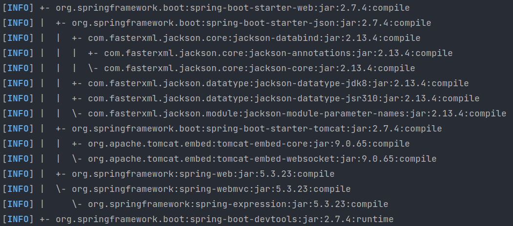
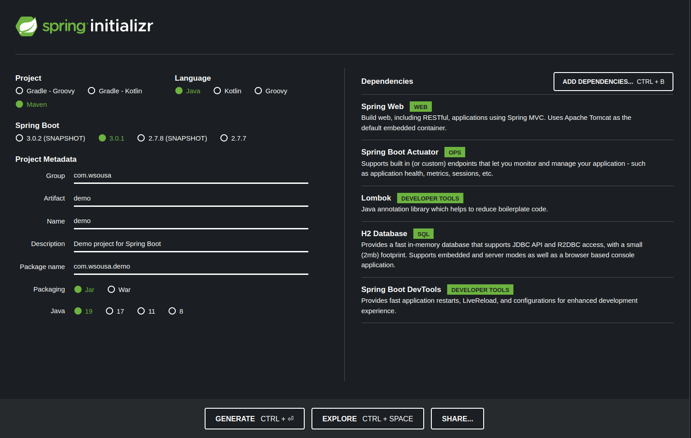
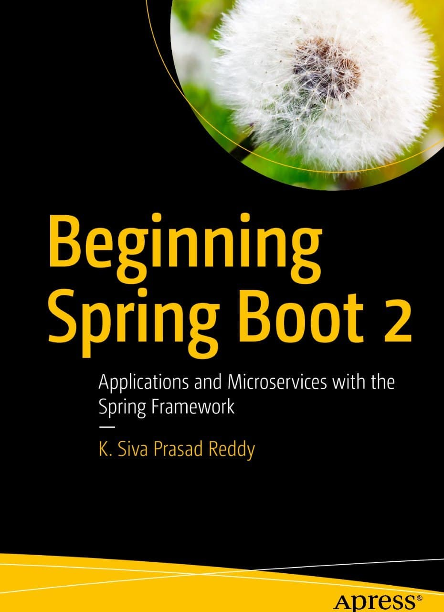
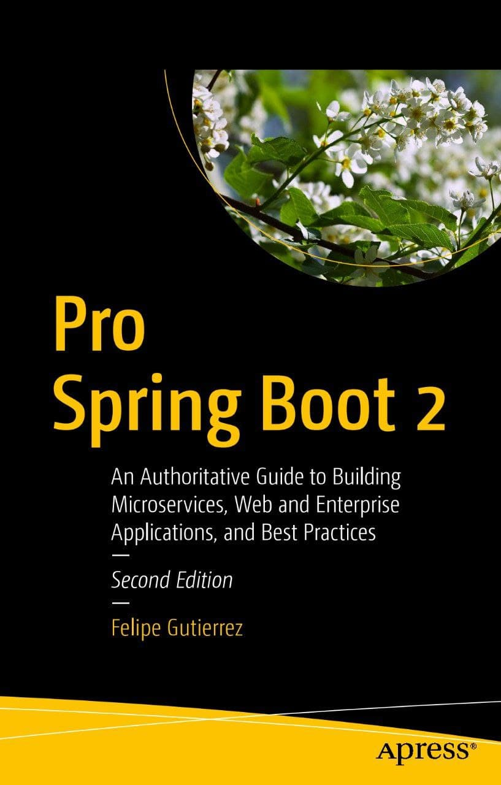
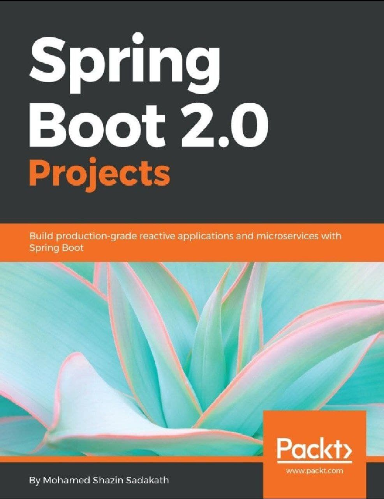
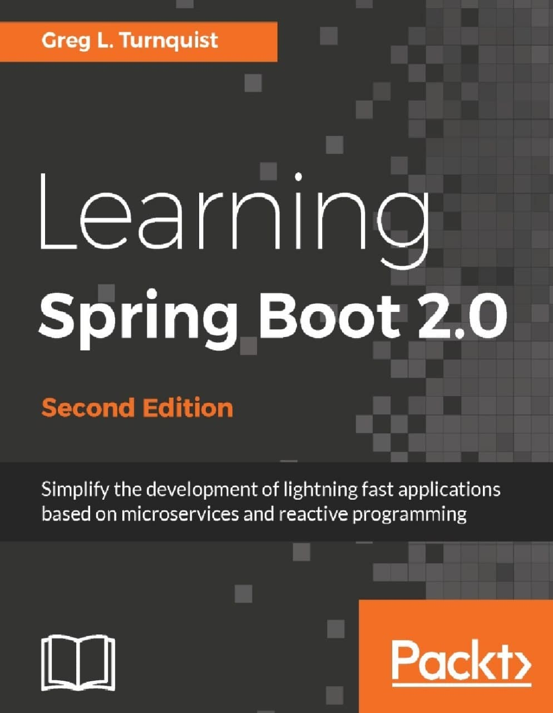
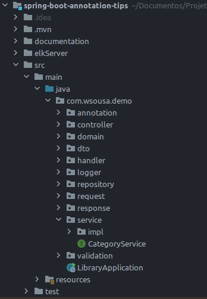

# Spring Boot: Tudo que você precisa saber!

Para todos os que buscam se solidificar em uma carreira de desenvolvimento de aplicações usando Java, devem alem de buscar todos os conhecimentos em OOP,
como citei no meu artigo [15 Tips to Become a Java Expert!](https://dev.to/weder96/15-tips-to-become-a-java-expert-1acj), na parte de aprender um framework/lib,

Nos primordios do desenvolvimento de aplicações utilizando Java faz se saber que o processo de configuração de ambientes de desenvolvimento era um momento complexo, chato e demorado. 

Mas, com o tempo foram criando ferramentas que tinhas essas funções confirguradas e cairam no gosto de nos desenvolvedores , e a que mais se usa em ambientes interprise ou até para projetos pequenos, esse framework se chama **Spring Boot** da Pivotal, é possível facilitar e muito nossa vida, muito mesmo, kkkk.

Nos que fazemos parte do time de desenvolvedores sabemos que o tempo para terminar nossas atividades e curto e de muita responsabilidade , e não se pode perder tempo configurando um projeto ao invés de desenvolver, então esse artigo vamos passar pelo pontos que você deve conhecer deste Framework, além de dicas sobre melhores praticas em seu uso.

Nossa missão aqui e tentar te auxiliar a entender o SpringBoot, para te ajudar a simplificar o desenvolvimento de aplicações Java, diminuindo a quantidade de configurações e otimizações, mas lembre-se não e zerar as configurações pois elas existem, mas hoje configuramos uma aplicação em velocidade que a 10 anos atras eram impensaveis.

Nesse artigo vamos abordar a seguinte ordem para dominar o **Spring Boot**:

 
1. O que é Spring Boot?
2. Os Componentes do Spring Boot
3. Como startar o Spring Boot?

1. O que é Spring Boot?

O Spring Boot é um framework que nasceu a partir do Spring(MVC), um framework desenvolvido para a plataforma Java baseado nos padrões de projetos, IOC(inversão de controle) e ID(injeção de dependência), sendo que os dois são padrões de projeto que ajuda muito a deixar o código desacoplado.

Spring framework foi criado para simplificar as configurações para aplicações web, porem você ainda configurava muito arquivos xml,o que não conseguiu a atender seu objetivo, mas que já te auxiliava em grandes situações, além do projeto sair com suas camadas bem definidas.

Sendo assim, um novo projeto foi acrescentado ao framework para mudar esse jogo e abstrair toda a complexidade que uma configuração completa pode trazer: o Spring Boot. 

Assim o Spring Boot 1.0 foi lançado em abril de 2014. O Spring Framework 4.2.0, nesse modelo de desenvolvimento mais simples e direto, esse framework foi determinante para que o uso do **ecossistema Spring se tornasse o queridinho dos Programadores**. 

**Mas o que ele entrega que o fez crescer tanto?**

Ele nos fornece a maioria dos componentes necessários em aplicações em geral de maneira pré-configurada, possibilitando uma aplicação rodando em produção rapidamente, reduzzindo o esforço de configuração e implantação, sendo aclopado ja o servidor de Aplicação tomcat.

Resumindo o  Spring Boot como um template pré-configurado para desenvolvimento e execução de aplicações baseadas no Spring.

2. Os Componentes do Spring Boot

O [spring-boot](https://spring.io/projects/spring-boot), na data de escrita deste artigo o mesmo se encontra na versão 3.0.1, com cerca de 21 libs que te auxiliar na construção de suas aplicações :

1. Spring Framework
2. Spring Data
3. Spring Cloud
4. Spring Cloud Data Flow
5. Spring Security
6. Spring for GraphQL
7. Spring Session
8. Spring Integration
9. Spring HATEOAS
10. Spring REST Docs
11. Spring Batch
12. Spring AMQP
13. Spring CredHub
14. Spring Flo
15. Spring for Apache Kafka
16. Spring LDAP
17. Spring Shell
18. Spring Statemachine
19. Spring Vault
20. Spring Web Flow
21. Spring Web Services

**Mas com esse tanto de libs, como identificar o que devo entender primeiro?**

Vamos dividir essa primeira parte em 3 fragmentos:

- Spring Boot Starter
- Spring Boot AutoConfigurator
- Spring Boot Actuator

### **Spring Boot Starter**

Quando criamos uma aplicação queremos fornecer meio de acesso a está aplicação então desenvolvemos os serviços REST; que neste momemto estamos utilizando por tras libs como Spring MVC, Tomcat e Jackson – entre outras muitas dependências para um único aplicativo.

Assim o Spring Boot para nos ajudar a diminuir o número de dependências adicionadas manualmente apenas adicionando uma dependência. Portanto, em vez de especificar manualmente as dependências, sendo assim somente e necessario adicionar no nosso pom.xml a lib seguir:

<dependency>
    <groupId>org.springframework.boot</groupId>
    <artifactId>spring-boot-starter-web</artifactId>
</dependency>

Quando você executa o comando do maven abaixo:

mvn dependency:tree

Result:

Este comando nos mostra todas as dependencias de uma lib:
no caso cada nivel mostra se a mesma tem outras dependencias internas ou não, no primeiro nivel temos:

org.springframework.boot:spring-boot-starter-json
org.springframework.boot:spring-boot-starter-tomcat
org.springframework:spring-web

Como visto ao executar o comando a função do Springboot é combinar as várias dependências advindas de um projeto Spring Boot em uma única dependência, retirando-se a necessidade de configuração de múltiplas dependências no Maven ou no Gradle.

Notamos, que se tivessemos que adicionar uma a uma esse processo seria bem trabalhoso. Sendo assim, Spring Boot utiliza os inicializadores (starters) a fim de diminuí-lo significativamente. 

### **Spring Boot AutoConfigurator**

A configuração automática do Spring Boot tenta configurar automaticamente seu aplicativo Spring com base nas dependências jar que você adicionou. 

Por exemplo, se HSQLDB estiver em seu caminho de classe e você não tiver configurado manualmente nenhum beans de conexão de banco de dados, o Spring Boot configurará automaticamente um banco de dados na memória.

Você precisa aceitar a configuração automática adicionando as anotações @EnableAutoConfiguration ou @SpringBootApplication a uma de suas classes @Configuration.

Sim mas todas as configurações estão na [documentação oficial](https://docs.spring.io/spring-boot/docs/2.0.x/reference/html/using-boot-auto-configuration.html#:~:text=Spring%20Boot%20auto%2Dconfiguration%20attempts,configures%20an%20in%2Dmemory%20database.), sobre esse processo.

É responsável por gerenciar o processo de configuração de uma aplicação Spring Boot, fornecendo as configurações-padrão e fazendo a fusão destas com as possíveis configurações personalizadas, você pode criar classe anotadas que configuram alguma função do sua aplicação.

Em uma aplicação Spring Boot, o AutoConfigurator pode ser visto através da utilização da tradicional annotation @SpringBootApplication, que fica acima do método de inicialização da aplicação.

Internamente, a annotation @SpringBootApplication  é uma combinação das tradicionais annotations @Configuration, @ComponentScan e @EnableAutoConfiguration do Spring.

### **Spring Boot Actuator**

O Spring Boot Actuator, ele nos fornece endpoints que facilita a obtenção de métricas da nossa aplicação.

Ao configurar o maven com a dependencia abaixo:

<dependency>
    <groupId>org.springframework.boot</groupId>
    <artifactId>spring-boot-starter-actuator</artifactId>
</dependency>

O Spring Boot AutoConfigurator define que o servidor web deve ser exposto em localhost na porta 8080, mas vcpode redefinir essa porta. Porem quem faz o provisionamento desta configuração no servidor web é o Actuator.

No meu github tem um projeto [SpringBootActuatorPrometheus](https://github.com/weder96/SpringBootActuatorPrometheus) que ensina a ativar o mesmo e interligar ao Prometheus e ao Kibana, e visualizar seus graficos com as meticas do micrometer e spring boot Statistic. 

3. Como startar o Spring Boot?

Então como criar meu primeiro projeto com spring boot, para começar a entender, e sim o springboot nos auxilair , pois ele criou um site onde podemos criar nossa criar uma aplicação base, chamado de Spring Initializr, basta acessar https://start.spring.io/ e inserir as informações necessárias sobre projeto.  

No meu [15 Tips to Become a Java Expert!](https://dev.to/weder96/15-tips-to-become-a-java-expert-1acj), onde cito [https://dev.to/weder96/15-tips-to-become-a-java-expert-1acj#section-10](https://dev.to/weder96/15-tips-to-become-a-java-expert-1acj#section-10)

E devemos entender como funciona o maven ou gradle, sempre achei as configurações do maven mais facil e com uma comunidade mais atuante em ajudar, mas tem muitos artigos bons sobre gradle.

Sempre coloco nos meus projetos o lombok devido o mesmo facilitar em questões de geração de codigo(Getter. Setter, ToString, Slf4j, Builder) entre outros que te ajudarão em varias ações rapidas alem de deixar as classes somente com o necessario de codigo.

O legal aqui no soomente marco as caixinhas e busco as libs que quero e clic no botão **Generate** e como num passe de magica o seu projeto está pronto e configurado para que sua lógica de negócio seja desenvolvida. 

No proximo passo você consegue importar esse projeto para desenvolvê-lo em sua IDE  de preferencia exemplo [Eclipse](https://www.eclipse.org/downloads/), [Netbeans](https://netbeans.apache.org/) ou [IntelliJ](https://www.jetbrains.com/idea/download/#section=linux).

**E você qual IDE você prefere ?**

Já usei todas as 3 acima citada, mas no dia-a-dia o Intellij, tem ganhado um espaço dentro das organizações, então atualmente somente uso a mesma e sempre gosto de validar como está o Eclipse que em muitas empresas usa no desenvolvimento.

Depois desta parte Teorica que também não sou fa de muita conversinha, gosto e de por a mão na massa.

### Qual é a melhor maneira de aprender Spring Boot um novo framework?

Essa questão no incio da minha busca pelo conhecimento sobre o assunto era com certeza livros.
Bem, eu sou um grande fã de livros incondicionalmente pois ele te mostram um pouco não somente do que você está aprendendo, mais a experiencia do autor, mas com a grande quantidade de cursos online, fico dividido e tenho que analisar sempre, pois há curso com um grau de aprendizado maior e na maioria dos casos uma escolha melhor.

Eles são mais interativos e você aprende muitas coisas em muito pouco tempo. Eles também são muito baratos hoje em dia, outro motivo que é bem relevante, mesmo sabendo que não e gasto e investimento.

Alguns desses cursos de Spring Boot estão espalhados em varios locais como Udemy custam pouco comparado com o conteúdo, aliás, se você ainda gosta de começar com livros como eu, aqui vai uma lista.

Spring Boot in Action (Craig Walls)

Beginning Spring Boot 2 Applications and Microservices with the Spring Framework

Pro Spring Boot 2 An Authoritative Guide to Building Microservices, Web and Enterprise Applications, and Best Practices Second Edition

Spring Boot 2.0 Projects Build production-grade reactive applications and microservices with Spring Boot

Learning Spring Boot 2.0 Greg L. Turnquist

Cada um tem muitos conteudos de qualidade.

Já no youtube tem curso bons e gratuitos como [Spring Boot Tutorial | Full Course](https://www.youtube.com/watch?v=9SGDpanrc8U), esse segue um contexto mais especifico e usa Intellij, demostra as ligações e outras ferramentas para auxiliar o seu entendimento.

Outro que chama atenção [Spring Boot Quick Start - Java Brains](https://www.youtube.com/watch?v=msXL2oDexqw&list=PLqq-6Pq4lTTbx8p2oCgcAQGQyqN8XeA1x), esse segundo e bem didatico, mas não foca bem em camadas(package), mas te da uma ideia de ligações bem estruturadas em camadas.

**Mas vc recomenda algum curso em portugues sobre Spring boot?**

Um gratuito e pode ser encontrado no Youtube, são os cursos do DevDojo, os caras e sem base são feras, quando o assunto e distribuir um curso gartuito e de qualidade [Spring Boot 2 Essentials](https://www.youtube.com/watch?v=bCzsSXE4Jzg&list=PL62G310vn6nFBIxp6ZwGnm8xMcGE3VA5H)

Agora se você quer o Curso e não está preocupado em gastar uma grana, tem o melhor e mais completo curso de [Especialista Rest da Algaworks](https://cafe.algaworks.com/esr-matriculas-abertas-ago/) e fortissimo o curso, são 25 modulos que te ensinam todos os conteudo que você precisar pra ser um especialista, não estou fazendo aqui propaganda, quem já fez o curso sabe que o custo beneficio compensa pois o curso e muito bom.

## **Ok, temos livros e cursos, mas o que realmente o mercado quer de mim como Desenvolvedor em alto nivel?**

Quando eu fiz essa pergunta, muita coisa mudou na minha vida, e Graças a Deus, muita coisa mudou pra melhor.

Comecei a buscar vagas e ver o que era padrão entre elas, tanto backEnd como FrontEnd, pois tenho habilidades dentro dessas areas.

O que chamou atenção e que todas as vagas em que os salarios eram melhores e tinhas muitas pessoas que falavam bem das  contratantes no [**Glassdoor**](https://www.glassdoor.com.br/member/home/index.htm), sempre queria desenvolvedor Java, que conhecia mensageria, que sabia sobre microservicos e seus design Patterns ou novas arquiteturas voltadas para microservicos (Spring Cloud).

Outra questão será que o tanto que sabia era suficiente, será que tinha colocado a mão na massa suficiente? nunca vamos conseguir responder essas questões pois sempre depende do tipo e tamanho do projeto, mas naquele momento todas as questões sobre o assunto conseguia responder, já tinha feito varios exemplos e já tinha repassado o site [https://microservices.io/](https://microservices.io/) escrito por [Chris Richardson](https://www.oreilly.com/pub/au/2296).

Como gosto de um bom livro mas o de [Chris Richardson](https://www.oreilly.com/pub/au/2296) com titulo [Microservices Patterns WITH EXAMPLES IN JAVA CHRIS R ICHARDSON](https://www.amazon.com.br/Microservice-Patterns-examples-Chris-Richardson/dp/1617294543) é um daqueles que causa dor e "sem dor sem ganho". no [Join Community 2022](https://github.com/weder96/demoJoinCommunity), destaquei alguns deste ponto com o problemas que temos ao sair do monolito e migrar a um micro serviço, e descobrimos que se arquitetura de software não estiver lado a lado com o desenvolvedor, os problemas podem ser catrastrofico, e se você como desenvolvedor não entende o também são dois que estarão em um barco velejando sem rumo , e qualquer lugar tá valendo, e que vemos e que essa galera sempre abandona o barco(Troca de emprego).

Certo mas o que importa para o mercado de trabalho, vc tem que entender bem sobre: 

Orientação a objetos(Pilares da OOP).
Conhecer as funçoes sobre cada design patterns (criacional), e como usar os principais exemplo(Builder, Adapter, Facade, Factory). 
Collections e as diferenças entre lista, pilha, fila e mapas, lembre-se aqui não somente teoria vc deve dominar o assunto, saber todas as formas de percorrer, cada um dos tipos, e como percorrer mapas(ForEach, Entry, key, value)
Sua capacidade de criação de base de dados(DDL) e (SQL) , na maioria das vezes somente entender a questão sobre relação entre entidades.

Show, mas até aqui e somente trabalhar com Java e Banco de Dados, abaixo são caracteristicas para dominar o Spring boot.

Pra dominar o conhecimento sobre Spring boot a primeira e principal e saber o que IOC(Inversão de Controle),e o queé um Bean:

Depois vc deve entender todas as principais annotations do Spring

1. @Bean
2. @Service
3. @Repository
4. @Configuration
5. @RestController/@Controller
6. @RequestMapping
7. @Autowired
8. @Component
9. @SpringBootApplication
10. @EnableAutoConfiguration
11. @ComponetScan
12. @Required
13. @Qualifier
14. @CookieValue
15. @Lazy
16. @Transactional

A @Transactional considero vc a estudar ela separadamente pois ela tem algumas questões bem relevantes, na questões de commit, rollback.

Agora depois de entender todos esse negocios loucos, vamos testar suas habilidade em quebrar um comportamento da Aplicação em camadas, Ah que legal, abaixo um modelo. eu disse modelo.

Lembre-se não ditamos regras somente uma possibilida, vc e o arquiteto da sua aplicação vc conhece a mesma, vc define o que acha certo, mesmo que outras digam o contrario e na maioria das vezes entraremos em discuções como  o (Batman derrota o Supermen) ou (Criar curso de dev da mais dinheiro do que desenvolver algo) , se vc tiver preparado esse [github](https://github.com/pilhacheia/tretadev/issues?page=2&q=is%3Aissue+is%3Aopen), tem dezenas dessas questões pra "colocar fogo no parquinho".

A imagem acima e somente um modelo, que poder te ajudar a entender como  fazer um CRUD, vc deve criar a primeira a fronteira no nosso caso sempre será **controller**, aqui ficam seus metodos de GET, POST, PUT , DELETE e PATCH.

A **entity** ou **domain** e onde colocamos nossas classe que representa um tabela no nosso database.

O **service** e **serviceImpl** tem uma função bem especifica o primeiro e uma interface o segundo e uma classe concreta que implementa sua interface, aqui que vc colocar as regras de negocio.

O **repository**, guardam a ligação direta com o database, aqui que vc faz suas queries, lembre-se o mapeamento ficam dentro da **entity**, mas e no repository que as consultas são criadas.

**Mas por que vc tem um pacote(package), com dto ?** 

Que pergunta excelente, devemos proteger as nossas entidades , para evitar alguns problemas de segurança e também transferir somente o necessario dos objetos que buscamos via DAO(Data Access Object) então criamos DTO(Data Transport Object), para criamos meios de adaptar e mapear nossos entidade em dtos ou ao contrario  dtos em entidades, aqui tem duas libs que e necessario vc saber sobre elas [Mapstruct](https://mapstruct.org/) e [ModelMapper](http://modelmapper.org/).

