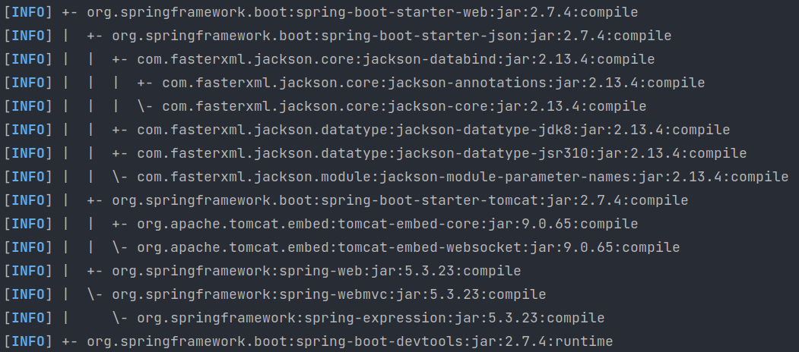

# Spring Boot: Tudo que você precisa saber, e o que ninguem te contou.

Para todos os que buscam se solidificar em uma carreira de desenvolvimento de aplicações usando Java, devem alem de buscar todos os conhecimentos em OOP(Programação Orientada a Objetos), como citei no meu artigo [15 Tips to Become a Java Expert!](https://dev.to/weder96/15-tips-to-become-a-java-expert-1acj), na dica de aprender um framework/lib, devemos nos desenvolver em outras frente que nos darão suporte, na nossa carreira como desenvolvedor.

Nos primordios do desenvolvimento de aplicações utilizando Java faz se saber que o processo de configuração de ambientes de desenvolvimento era um momento complexo, chato e demorado. 

Mas, com o tempo foram criando ferramentas que tinhas essas funções confirguradas e cairam no gosto de nos desenvolvedores , e a que mais se usa em ambientes interprise ou até para projetos pequenos, esse framework se chama **Spring Boot** da Pivotal, é possível facilitar e muito nossa vida, muito mesmo, kkkk.

Nos que fazemos parte do time de desenvolvedores sabemos que o tempo para terminar nossas atividades e curto e de muita responsabilidade , e não se pode perder tempo configurando um projeto ao invés de desenvolver, então esse artigo vamos passar pelo pontos que você deve conhecer deste Framework, além de dicas sobre melhores praticas em seu uso.

Nossa missão aqui e tentar te auxiliar a entender o SpringBoot, para te ajudar a simplificar o desenvolvimento de aplicações Java, diminuindo a quantidade de configurações e otimizações, mas lembre-se não e zerar as configurações pois elas existem, mas hoje configuramos uma aplicação em velocidade que a 10 anos atras eram impensaveis.

Nesse artigo vamos abordar a seguinte ordem para dominar o **Spring Boot**:

Este artigo esta dividido em 3 Partes: 


[A: Como começar a aprender o Spring boot](https://github.com/weder96/spring-boot-annotation-tips/tree/main/documentation/Part01)<br/>
[B: Questões Sobre Microserviços e Serviços Assincronos(Rabbit, Kafka, SQS)](https://github.com/weder96/spring-boot-annotation-tips/tree/main/documentation/Part02)<br/>
[C: Segurança com Spring Security, Upload Download e Deploy (Cloud)](https://github.com/weder96/spring-boot-annotation-tips/tree/main/documentation/Part03)<br/>


Aqui começaremos pela Téoria, sobre: 

**1. O que é Spring** <br/>
**2. O que é Spring Boot?**<br/>
**3. Os Componentes do Spring**<br/>
**4. Spring Boot Starter**<br/>
**5. Spring Boot AutoConfigurator**<br/>
**6. Spring Boot Actuator**<br/>

-----------------------------------------------------------------------------------------------------------
### **1. O que é Spring**

Spring é um framework Java que foi criado com o objetivo de facilitar o desenvolvimento de aplicações, utilizando os conceitos de Inversão de Controle e Injeção de Dependências. Dentro dele, há o Spring MVC e o Core Technologies (é a base do Spring, dentro dele há o pacote de injeção de dependências).


### **2. O que é Spring Boot?**

O Spring Boot é um framework que nasceu a partir do Spring(MVC), um framework desenvolvido para a plataforma Java baseado nos padrões de projetos, IOC(inversão de controle) e ID(injeção de dependência), sendo que os dois são padrões de projeto que ajuda muito a deixar o código desacoplado.

Spring framework foi criado para **simplificar** as **configurações** para aplicações web, porem você ainda configurava muito arquivos xml,o que não conseguiu a atender seu objetivo, mas que já te auxiliava em grandes situações, além do projeto sair com suas camadas bem definidas.


Sendo assim, um novo projeto foi acrescentado ao framework para mudar esse jogo e abstrair toda a complexidade que uma configuração completa pode trazer: **O Spring Boot**. 

Assim o **Spring Boot 1.0** foi lançado em **abril de 2014**. O **Spring Framework 4.2.0**, nesse modelo de desenvolvimento mais simples e direto, esse framework foi determinante para que o uso do **ecossistema Spring se tornasse o queridinho dos Programadores**. 

**Mas o que ele entrega que o fez crescer tanto?**

Ele nos fornece a maioria dos componentes necessários em aplicações em geral de maneira pré-configurada, possibilitando uma aplicação rodando em produção rapidamente, reduzzindo o esforço de configuração e implantação, sendo aclopado ja o servidor de Aplicação tomcat.

Resumindo o  Spring Boot como um template pré-configurado para desenvolvimento e execução de aplicações baseadas no Spring.

-----------------------------------------------------------------------------------------------------------

### **3. Os Componentes do Spring**

O [spring-boot](https://spring.io/projects/spring-boot), na data de escrita deste artigo o mesmo se encontra na versão 3.0.1, e o mesmo faz parte de outros projetos da [spring.io](https://spring.io/projects) com cerca de 21 libs que te auxiliar na construção de suas aplicações :

1. [Spring Boot](https://spring.io/projects/spring-boot)
2. [Spring Framework](https://spring.io/projects/spring-framework)
3. [Spring Data](https://spring.io/projects/spring-data)
4. [Spring Cloud](https://spring.io/projects/spring-cloud)
5. [Spring Cloud Data Flow](https://spring.io/projects/spring-cloud-dataflow)
6. [Spring Security](https://spring.io/projects/spring-security)
7. [Spring for GraphQL](https://spring.io/projects/spring-graphql)
8. [Spring Session](https://spring.io/projects/spring-session)
9. [Spring Integration](https://spring.io/projects/spring-integration)
10. [Spring HATEOAS](https://spring.io/projects/spring-hateoas)
12. [Spring REST Docs](https://spring.io/projects/spring-restdocs)
13. [Spring Batch](https://spring.io/projects/spring-batch)
14. [Spring AMQP](https://spring.io/projects/spring-amqp)
15. [Spring CredHub](https://spring.io/projects/spring-credhub)
16. [Spring Flo](https://spring.io/projects/spring-flo)
17. [Spring for Apache Kafka](https://spring.io/projects/spring-kafka)
18. [Spring LDAP](https://spring.io/projects/spring-ldap)
19. [Spring Shell](https://spring.io/projects/spring-shell)
20. [Spring Statemachine](https://spring.io/projects/spring-statemachine)
21. [Spring Vault](https://spring.io/projects/spring-vault)
22. [Spring Web Flow](https://spring.io/projects/spring-webflow)
23. [Spring Web Services](https://spring.io/projects/spring-ws)

**Mas com esse tanto de libs, como identificar o que devo entender primeiro?**

Vamos dividir essa primeira parte em 3 fragmentos:

- Spring Boot Starter
- Spring Boot AutoConfigurator
- Spring Boot Actuator

-----------------------------------------------------------------------------------------------------------
### **4. Spring Boot Starter**

Quando criamos uma aplicação queremos fornecer meio de acesso a está aplicação então desenvolvemos os serviços REST; que neste momemto estamos utilizando por tras libs como Spring MVC, Tomcat e Jackson – entre outras muitas dependências para um único aplicativo.

Assim o Spring Boot para nos ajudar a diminuir o número de dependências adicionadas manualmente apenas adicionando uma dependência. Portanto, em vez de especificar manualmente as dependências, sendo assim somente e necessario adicionar no nosso pom.xml a lib seguir:

```
<dependency>
    <groupId>org.springframework.boot</groupId>
    <artifactId>spring-boot-starter-web</artifactId>
</dependency>
```

Quando você executa o comando do maven abaixo:

```
mvn dependency:tree
```

Result:




Este comando nos mostra todas as dependencias de uma lib:
no caso cada nivel mostra se a mesma tem outras dependencias internas ou não, no primeiro nivel temos:

org.springframework.boot:spring-boot-starter-json
org.springframework.boot:spring-boot-starter-tomcat
org.springframework:spring-web

Como visto ao executar o comando a função do Springboot é combinar as várias dependências advindas de um projeto Spring Boot em uma única dependência, retirando-se a necessidade de configuração de múltiplas dependências no Maven ou no Gradle.

Notamos, que se tivessemos que adicionar uma a uma esse processo seria bem trabalhoso. Sendo assim, Spring Boot utiliza os inicializadores (starters) a fim de diminuí-lo significativamente. 


Lembre-se que está lib e a que habilita você a criar controllers para usar as anotações que vamos ver logo mais.

-----------------------------------------------------------------------------------------------------------

### **5. Spring Boot AutoConfigurator**

A configuração automática do Spring Boot tenta configurar automaticamente seu aplicativo Spring com base nas dependências jar que você adicionou. 

Por exemplo, se HSQLDB estiver em seu caminho de classe e você não tiver configurado manualmente nenhum beans de conexão de banco de dados, o Spring Boot configurará automaticamente um banco de dados na memória.

Você precisa aceitar a configuração automática adicionando as anotações @EnableAutoConfiguration ou @SpringBootApplication a uma de suas classes @Configuration.

Sim mas todas as configurações estão na [documentação oficial](https://docs.spring.io/spring-boot/docs/2.0.x/reference/html/using-boot-auto-configuration.html#:~:text=Spring%20Boot%20auto%2Dconfiguration%20attempts,configures%20an%20in%2Dmemory%20database.), sobre esse processo.


É responsável por gerenciar o processo de configuração de uma aplicação Spring Boot, fornecendo as configurações-padrão e fazendo a fusão destas com as possíveis configurações personalizadas, você pode criar classe anotadas que configuram alguma função do sua aplicação.

Em uma aplicação Spring Boot, o AutoConfigurator pode ser visto através da utilização da tradicional annotation @SpringBootApplication, que fica acima do método de inicialização da aplicação.

Internamente, a annotation @SpringBootApplication  é uma combinação das tradicionais annotations @Configuration, @ComponentScan e @EnableAutoConfiguration do Spring.


-----------------------------------------------------------------------------------------------------------

### **6. Spring Boot Actuator**

O Spring Boot Actuator, ele nos fornece endpoints que facilita a obtenção de métricas da nossa aplicação.

Ao configurar o maven com a dependencia abaixo:

<dependency>
    <groupId>org.springframework.boot</groupId>
    <artifactId>spring-boot-starter-actuator</artifactId>
</dependency>

O Spring Boot AutoConfigurator define que o servidor web deve ser exposto em localhost na porta 8080, mas vocêpode redefinir essa porta. Porem quem faz o provisionamento desta configuração no servidor web é o Actuator.

No meu github tem um projeto [SpringBootActuatorPrometheus](https://github.com/weder96/SpringBootActuatorPrometheus) que ensina a ativar o mesmo e interligar ao Prometheus e ao Kibana, e visualizar seus graficos com as meticas do micrometer e spring boot Statistic. 