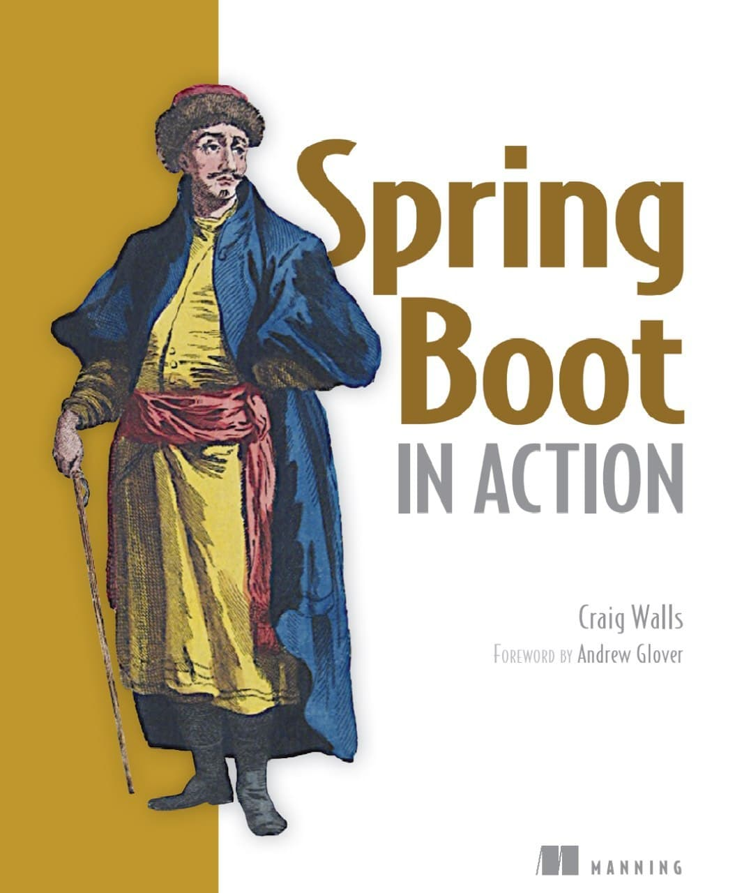
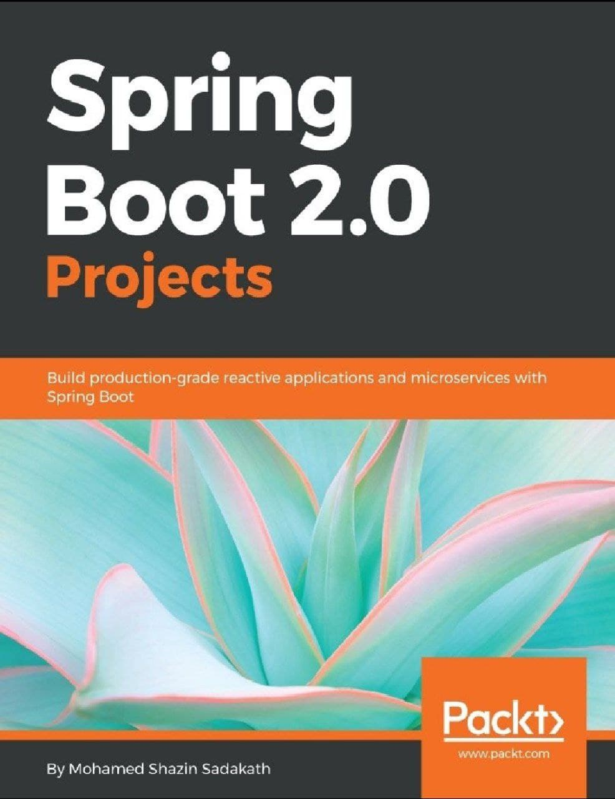

# Como começar a aprender o Spring boot.

[B: Questões Sobre Microserviços e Serviços Assincronos(Rabbit, Kafka, SQS)](https://github.com/weder96/spring-boot-annotation-tips/tree/main/documentation/Part02)<br/>
[C: Segurança com Spring Security, Upload Download e Deploy (Cloud)](https://github.com/weder96/spring-boot-annotation-tips/tree/main/documentation/Part03)<br/>


**7. Como startar o Spring Boot?**<br/>
**8. Qual é a melhor maneira de aprender Spring Boot um novo framework?**<br/>
**9. Mas vc recomenda algum curso em portugues sobre Spring boot?**<br/>
**10. Ok, temos livros e cursos, mas o que realmente o mercado quer de mim como Desenvolvedor em alto nivel?**<br/>
**11. Outra questão será que o tanto que sabia era suficiente, será que tinha colocado a mão na massa suficiente?**<br/> 
**12. Certo mas o que importa para o mercado de trabalho, vc tem que entender bem sobre:**<br/>
**13. Senão tivesse o Spring como usaria este conceito(IoC e ID)?**<br/>
**14. Como estudar esse tanto de Anotação do Spring?**<br/>
**15. Mas existe algum material somente sobre as anotaçoẽs?**<br/>
**16. Mas como eu separo os pacotes(package) de um projeto Spring Boot?**<br/>
**17. Mas por que vc tem um pacote(package), com dto ?** <br/>
**18. Certo mas falando em database como o Spring Boot, pode nos auxiliar ?**<br/>
**19. Criando um CRUD**<br/>
**20. Você já criou e sabe criar uma @annotation no Java ?**<br/>

-----------------------------------------------------------------------------------------------------------

### **7. Como startar o Spring Boot?**

Então como criar meu primeiro projeto com spring boot, para começar a entender, e sim o springboot nos auxilair , pois ele criou um site onde podemos criar nossa criar uma aplicação base, chamado de Spring Initializr, basta acessar https://start.spring.io/ e inserir as informações necessárias sobre projeto.  


No meu artigo no dev.to [15 Tips to Become a Java Expert!](https://dev.to/weder96/15-tips-to-become-a-java-expert-1acj), onde cito [https://dev.to/weder96/15-tips-to-become-a-java-expert-1acj#section-10](https://dev.to/weder96/15-tips-to-become-a-java-expert-1acj#section-10)

E devemos entender como funciona o [**maven**](https://mvnrepository.com/) ou [**gradle**](https://gradle.org/), sempre achei as configurações do maven mais faceis(xml) e com uma comunidade mais atuante em ajudar, mas tem muitos artigos bons sobre gradle(json).

Sempre coloco nos meus projetos o [lombok](https://projectlombok.org/) devido o mesmo facilitar em questões de geração de codigo(Getter. Setter, ToString, Slf4j, Builder) entre outros que te ajudarão em varias ações rapidas além de deixar as classes somente com o necessario de codigo(clean).

O legal aqui no [https://start.spring.io/](https://start.spring.io/) e que somente marco as caixinhas e busco as libs que quero e clico no botão **Generate** e como num passe de magica o seu projeto está pronto e configurado para que sua lógica de negócio seja desenvolvida. 

No proximo passo você consegue importar esse projeto para desenvolvê-lo em sua IDE  de preferencia exemplo [Eclipse](https://www.eclipse.org/downloads/), [Netbeans](https://netbeans.apache.org/) ou [IntelliJ](https://www.jetbrains.com/idea/download/#section=linux).


**_E você qual IDE você prefere ?_**

Já usei todas as 3 acima citada, mas no dia-a-dia o **Intellij**, tem ganhado um espaço dentro das organizações, então atualmente somente uso a mesma e sempre gosto de validar como está o **Eclipse** que em muitas empresas usa no desenvolvimento.


Depois desta parte Teorica que também não sou fã de muita conversinha, gosto de colocar a mão na massa.


-----------------------------------------------------------------------------------------------------------

### **8. Qual é a melhor maneira de aprender Spring Boot um novo framework?**

Essa questão no incio da minha busca pelo conhecimento sobre o assunto era com certeza livros.

Bem, eu sou um grande fã de livros incondicionalmente pois ele te mostram um pouco não somente do que você está aprendendo, mais a experiencia do autor.

Entretanto com a grande quantidade de cursos online, fiquei dividido e tenho que analisar sempre, pois há curso com um grau de aprendizado maior e na maioria dos casos se torna um escolha melhor.

Eles são mais interativos e você aprende muitas coisas em muito pouco tempo. Eles também são muito baratos hoje em dia, outro motivo que é bem relevante, mesmo sabendo que não e gasto e investimento.

Alguns desses cursos de Spring Boot estão espalhados em varios locais como Udemy custam pouco comparado com o conteúdo, aliás, se você ainda gosta de começar com livros como eu, aqui vai uma lista.


Spring Boot in Action (Craig Walls)



[Spring-Boot-Action-Craig-Walls](https://www.amazon.com.br/Spring-Boot-Action-Craig-Walls/dp/1617292540)


Beginning Spring Boot 2 Applications and Microservices with the Spring Framework


[BeginningSpring2](https://www.amazon.com.br/Pro-Spring-Boot-Authoritative-Microservices/dp/1484236750/ref=sr_1_2?__mk_pt_BR=%C3%85M%C3%85%C5%BD%C3%95%C3%91&keywords=Beginning+Spring+Boot+2+Applications+and+Microservices+with+the+Spring+Framework&qid=1672235731&s=books&sr=1-2&ufe=app_do%3Aamzn1.fos.6121c6c4-c969-43ae-92f7-cc248fc6181d)


Spring Boot 2.0 Projects Build production-grade reactive applications and microservices with Spring Boot



[Spring Boot 2.0 Projects Build](https://www.amazon.com.br/Spring-Projects-Mohamed-Shazin-Sadakath/dp/1789136156/ref=sr_1_1?__mk_pt_BR=%C3%85M%C3%85%C5%BD%C3%95%C3%91&crid=1BCLKVRTO3XJC&keywords=Spring+Boot+2.0+Projects&qid=1672235968&s=books&sprefix=spring+boot+2.0+projects%2Cstripbooks%2C273&sr=1-1&ufe=app_do%3Aamzn1.fos.e05b01e0-91a7-477e-a514-15a32325a6d6)


Pro Spring Boot 2 An Authoritative Guide to Building Microservices, Web and Enterprise Applications, and Best Practices Second Edition


[Pro Spring Boot 2](https://www.amazon.com.br/Pro-Spring-Boot-Authoritative-Microservices/dp/1484236750/ref=sr_1_2?__mk_pt_BR=%C3%85M%C3%85%C5%BD%C3%95%C3%91&keywords=Beginning+Spring+Boot+2+Applications+and+Microservices+with+the+Spring+Framework&qid=1672235731&s=books&sr=1-2&ufe=app_do%3Aamzn1.fos.6121c6c4-c969-43ae-92f7-cc248fc6181d)


Learning Spring Boot 2.0 Greg L. Turnquist


[Learning Spring Boot 2.0](https://www.amazon.com.br/Learning-Spring-Boot-Greg-Turnquist/dp/1786463784/ref=sr_1_1?__mk_pt_BR=%C3%85M%C3%85%C5%BD%C3%95%C3%91&crid=3I8DYUSED94ET&keywords=Learning+Spring+Boot+2.0&qid=1672236020&s=books&sprefix=learning+spring+boot+2.0%2Cstripbooks%2C217&sr=1-1&ufe=app_do%3Aamzn1.fos.e05b01e0-91a7-477e-a514-15a32325a6d6)


Cada um tem muitos conteudos de qualidade.

Já no youtube tem curso bons e gratuitos como [Spring Boot Tutorial | Full Course](https://www.youtube.com/watch?v=9SGDpanrc8U), esse segue um contexto mais especifico e usa Intellij, demostra as ligações e outras ferramentas para auxiliar o seu entendimento.

Outro que chama atenção [Spring Boot Quick Start - Java Brains](https://www.youtube.com/watch?v=msXL2oDexqw&list=PLqq-6Pq4lTTbx8p2oCgcAQGQyqN8XeA1x), esse segundo e bem didatico, mas não foca bem em camadas(package), mas te da uma ideia de ligações bem estruturadas em camadas.

E na [UDemy](https://www.udemy.com/courses/search/?src=ukw&q=Spring+boot), aqui deixo um [Post - My Favorite Courses to Learn Spring Boot in 2022 — Best of Lot](https://medium.com/javarevisited/top-10-courses-to-learn-spring-boot-in-2020-best-of-lot-6ffce88a1b6e) muito bem detalhado sobre cursos s
obre Spring boot [Udemy](https://www.udemy.com/courses/search/?src=ukw&q=Spring+boot).


### **9. Mas vc recomenda algum curso em portugues sobre Spring boot?**

Um gratuito e pode ser encontrado no Youtube, são os cursos do DevDojo, os caras e sem base são feras, quando o assunto e distribuir um curso gartuito e de qualidade [Spring Boot 2 Essentials](https://www.youtube.com/watch?v=bCzsSXE4Jzg&list=PL62G310vn6nFBIxp6ZwGnm8xMcGE3VA5H)

Agora se você quer o Curso e não está preocupado em gastar uma grana, tem o melhor e mais completo curso de [Especialista Rest da Algaworks](https://cafe.algaworks.com/esr-matriculas-abertas-ago/) e fortissimo o curso, são 25 modulos que te ensinam todos os conteudo que você precisar pra ser um especialista, não estou fazendo aqui propaganda, quem já fez o curso sabe que o custo beneficio compensa pois o curso e muito bom.


--------------------------------------------------------------------------------------------------------------------------

### **10. Ok, temos livros e cursos, mas o que realmente o mercado quer de mim como Desenvolvedor em alto nivel?**

Quando eu fiz essa pergunta, muita coisa mudou na minha vida, e Graças a Deus, muita coisa mudou pra melhor.

Comecei a buscar vagas e ver o que era padrão entre elas, tanto backEnd como FrontEnd, pois tenho habilidades dentro dessas areas.

O que chamou atenção e que todas as vagas em que os salarios eram melhores e tinhas muitas pessoas que falavam bem das  contratantes no [**Glassdoor**](https://www.glassdoor.com.br/member/home/index.htm), sempre queria desenvolvedor Java, que conhecia mensageria, que sabia sobre microservicos e seus design Patterns ou novas arquiteturas voltadas para microservicos (Spring Cloud).

### **11. Outra questão será que o tanto que sabia era suficiente, será que tinha colocado a mão na massa suficiente?** 

Nunca iremos conseguir responder essa questão pois sempre depende do tipo e tamanho do projeto, mas naquele momento todas as questões sobre o assunto eu conseguia responder com agilidade e citando exemplos, pois já tinha feito varias POC(Prova Conceito), é já tinha repassado o site [https://microservices.io/](https://microservices.io/) escrito por [Chris Richardson](https://www.oreilly.com/pub/au/2296).

Como gosto de um bom livro mas o de [Chris Richardson](https://www.oreilly.com/pub/au/2296) com titulo [Microservices Patterns WITH EXAMPLES IN JAVA CHRIS R ICHARDSON](https://www.amazon.com.br/Microservice-Patterns-examples-Chris-Richardson/dp/1617294543) é um daqueles que causa dor e "sem dor sem ganho". no [Join Community 2022](https://github.com/weder96/demoJoinCommunity), destaquei alguns deste ponto com o problemas que temos ao sair do monolito e migrar a um micro serviço, e descobrimos que se arquitetura de software não estiver lado a lado com o desenvolvedor, os problemas podem ser catrastrofico, e se você como desenvolvedor não entende o também são dois que estarão em um barco velejando sem rumo , e qualquer lugar tá valendo, e que vemos e que essa galera sempre abandona o barco(Troca de emprego).

### **12. Certo mas o que importa para o mercado de trabalho, vc tem que entender bem sobre:**

- **Orientação a objetos** (Pilares da OOP).
- Conhecer as funçoes sobre cada **Design Patterns (criacional, Estrutural, Comportamental )**, e como usar os principais exemplo(**Builder, Factory, Singleton,  Adapter, Facade, Proxy, Observer, Chain of Responsibility, Strategy**). 
- **Collections** e as diferenças entre **lista, pilha, fila e mapas**, lembre-se aqui não somente teoria vc deve dominar o assunto, saber todas as formas de percorrer, cada um dos tipos, e como percorrer mapas **(ForEach, Entry, key, value)**
- Sua capacidade de criação de base de dados(**DDL**) e (**SQL**) , na maioria das vezes somente entender a questão sobre relação entre entidades.
- Principal, sua **capacidade de resolver problemas, simples, complexos** ou até aquele momento **quase impossivel**. 

Show, mas até aqui e somente trabalhar com Java e Banco de Dados, que são primordiais, mas no mercado de trabalho(Java - BackEnd) e necessario um pouco mais, e esse pouco estão direcionada as caracteristicas de quem **"DOMINA"** o Spring boot.

Pra dominar o conhecimento sobre Spring boot a primeira e principal e saber como o Spring que está por traz, funciona e começa com  o que é IOC(Inversão de Controle), (ID - Dependency Injection) e o que é um [@Bean](https://medium.com/@decioluckow/explorando-bean-spring-ioc-e640c53d29a9):

Quando digo dominar [IoC Container(Inversion of Control)](https://www.baeldung.com/inversion-control-and-dependency-injection-in-spring), e [ID - Dependency Injection](https://www.baeldung.com/inversion-control-and-dependency-injection-in-spring) E ter a ciencia de por que se usa estes em um projeto,  e não somente usar o Spring usando alguns tutoriais ou já pegar um projeto pronto. Mas como sei se compreendi, pra saber responda pra vc a pergunta abaixo.

### **13. Senão tivesse o Spring como usaria este conceito(IoC e ID)?**

Pois quando vc domina o Ciclo de vida e entende que um Bean é um Singleton e como [listar os Beans da minha aplicação](https://www.baeldung.com/spring-show-all-beans), ai vc compreende como usar as anotações do Spring.

Já que citamos **anotações** vc deve entender todas as principais **annotations** do Spring, abaixo uma listagens.

@Autowired <br/>
@Bean <br/>
@Component <br/>
@ComponentScan <br/>
@Configuration <br/>
@ConfigurationProperties <br/>
@CookieValue <br/>
@CrossOrigin <br/>
@DeleteMapping <br/>
@EnableAutoConfiguration <br/>
@GetMapping <br/>
@Lazy <br/>
@PathVariable <br/>
@Primary <br/>
@PostMapping <br/>
@Profile <br/>
@PropertySource <br/>
@PropertySources <br/>
@PutMapping <br/>
@Qualifier <br/>
@Required <br/>
@RestController/@Controller <br/>
@Repository <br/>
@RequestBody <br/>
@RequestMapping <br/>
@RequestParam <br/>
@Scope <br/>
@Service <br/>
@SpringBootApplication <br/>
@Value <br/>


Este artigo possui um [repositorio no github](https://github.com/weder96/spring-boot-annotation-tips), onde se encontra um projeto cujo a função dele e centralizar o uso das anotações do spring boot, e seus beneficios, lembrando que esse projeto está em continua fase de estudos e será atualizado, com outras questão e pode ser de ajuda a entender as anotações do Spring Boot.


### **14. Como estudar esse tanto de Anotação do Spring?**

Sempre devemos buscar a primeira, que é a [Documentação Oficial](https://docs.spring.io/spring-boot/docs/current/reference/htmlsingle/#getting-started), 
Mas tem uma galera que ja gosta e de ver o quanto tem perguntas e resposta sobre o [Framework SpringBoot](https://stackoverflow.com/search?q=spring+boot)
no Stackoverflow(na data deste artigo estava com 156,175 results), mas por que buscar no Stackoverflow?

A questão aqui e que muitos buscam como a comunidade está afinada com o Framework, ou se a mesma e ativa na ajuda de problemas que podem a vir a acontecer.

O proprio Spring possui um [github](https://github.com/spring-projects/spring-boot), com projetos [modelos](https://github.com/spring-projects/spring-boot/tree/main/spring-boot-project), que podem te ajudar a resolver alguns desafios na sua caminhada.

### **15. Mas existe algum material somente sobre as anotaçoẽs?**

Existe um canal no Youtube da [Michelli Brito](https://www.youtube.com/watch?v=Pd5tr483No0), que pode te auxiliar a entender todas essas anotações do Spring boot, ok, mais esse e em Português.

Fica triste não, nosso amigo [Java Techie](https://www.youtube.com/watch?v=htyq-mER0AE&t=927s) que nunca decepciona seus seguidores traz 40+ anotações, e explica seu uso.

Eu recomendo que a anotação [@Transactional](https://www.baeldung.com/transaction-configuration-with-jpa-and-spring), seja estudada separadamente pois ela tem algumas questões bem relevantes e especifica, na questões de commit, rollback entre entros pontos que e referente a persistencia dos objetos.

Agora depois de entender todos esse negocios loucos, vamos testar suas habilidade em quebrar um comportamento da Aplicação em camadas, Ah que legal, abaixo um modelo. eu disse modelo.

Lembre-se não ditamos regras somente uma possibilida, vc e o arquiteto da sua aplicação vc conhece a mesma, vc define o que acha certo, mesmo que outras digam o contrario e na maioria das vezes entraremos em discuções como  o (Batman derrota o Supermen) ou (Criar curso de dev da mais dinheiro do que desenvolver algo) , se vc tiver preparado esse [github](https://github.com/pilhacheia/tretadev/issues?page=2&q=is%3Aissue+is%3Aopen), tem dezenas dessas questões pra "colocar fogo no parquinho".

-------------------------------------------------------------------------------------------------------------------------
### **16. Mas como eu separo os pacotes(package) de um projeto Spring Boot?**


A imagem acima e somente um modelo, que poder te ajudar a entender como  fazer um CRUD, vc deve criar a primeira a fronteira no nosso caso sempre será **controller**, aqui ficam seus metodos de GET, POST, PUT , DELETE e PATCH.

A **entity** ou **domain** e onde colocamos nossas classe que representa um tabela no nosso database.

O **service** e **serviceImpl** tem uma função bem especifica o primeiro e uma interface o segundo e uma classe concreta que implementa sua interface, aqui que vc colocar as regras de negocio.

O **repository**, guardam a ligação direta com o database, aqui que vc faz suas queries, lembre-se o mapeamento ficam dentro da **entity**, mas e no repository que as consultas são criadas.


### **17. Mas por que vc tem um pacote(package), com dto ?** 

Que pergunta excelente, devemos proteger as nossas entidades , para evitar alguns problemas de segurança e também transferir somente o necessario dos objetos que buscamos via DAO(Data Access Object) então criamos DTO(Data Transport Object), para criamos meios de adaptar e mapear nossos entidade em dtos ou ao contrario  dtos em entidades, aqui tem duas libs que e necessario vc saber sobre elas [Mapstruct](https://mapstruct.org/) e [ModelMapper](http://modelmapper.org/).


### **18. Certo mas falando em database como o Spring Boot, pode nos auxiliar ?**

Vc deve adicionar a dependencia no pom.xml

```
<dependency>
	<groupId>org.springframework.boot</groupId>
	<artifactId>spring-boot-starter-data-jpa</artifactId>
</dependency>
```

No caso se estou usando o PostgreSQL tenho que adicionar também

```
<dependency>
	<groupId>org.postgresql</groupId>
	<artifactId>postgresql</artifactId>
	<scope>runtime</scope>
</dependency>
```

e dentro do seu application.properties


```
######## Database Configuration  #########
spring.datasource.url=jdbc:postgresql://localhost:5432/postgres
spring.datasource.username=postgres
spring.datasource.password=postgres

spring.jpa.properties.hibernate.dialect=org.hibernate.dialect.PostgreSQLDialect
spring.jpa.show-sql=true
spring.jpa.properties.hibernate.format_sql=true

```

No meu github tem um projeto [spring-boot-jpa-demo-java19](https://github.com/weder96/spring-boot-jpa-demo-java19), ensinando a subir um database em postgreSQL, docker, além de usar migrations. 

### **19. Criando um CRUD**

Neste momento depois de estudar e hora da POC(Prova Conceito), sempre e bom criar uma, então aqui vai aquela dica que todos tem que fazer o famoso CRUD.

C - Create -> Criar um objeto via Controller(POST), passando pelo service e usando o metodo save do seu Repository. 
R - Read   -> Listar os dados via Controller(GET), passando pelo service e usando o metodo findAll do seu Repository
U - Update -> Alterar um objeto via Controller(PUT), passando pelo service e usando o metodo save do seu Repository.
D - Delete -> deletar um Objeto via Controller(DELETE) , passando pelo service e usando o metodo delete do seu Repository.

[Crud de Exemplo com Java](https://github.com/weder96/crudApiJava).

Quando lidamos com CRUD um ponto importante e vc saber como criar DTOs não somente usando frameworks como  [Mapstruct](https://mapstruct.org/) e [ModelMapper](http://modelmapper.org/), mas como inicializar um DTO usando a propria query e também quando necessario criar um RespositoryCustom, e entender sobre JPQL.

A uma pagina da [baeldung](https://www.baeldung.com/learn-jpa-hibernate), que te mostra um caminho bem legal no caso: 

- Defining Entities
- Entity Relationships
- Identifiers
- Read Operations
- Pagination and Sorting
- Query Results
- Write Operations

Certo mas será que não existe um curso top, que vale o investimento, outra vez não estou fazendo propaganda, mas o [Especilista JPA](https://cafe.algaworks.com/ejpa-conteudo/?gclid=CjwKCAiAzKqdBhAnEiwAePEjklzVYUnvQu54ebQoo_l3g_yDO1eGseY7U1X8JxhR5lXfA1s65K1RohoC1sgQAvD_BwE), é um curso completo e vc terá um conhecimento profundo sobre como trabalhar com JPA(Java Persistence API).


Aqui e bom destacar que vc em alguns caso criar [auditoria em uma tabela](https://www.baeldung.com/database-auditing-jpa), antes de alterar ou excluir uma informação da sua base de dados.

Neste ponto tem algumas @Annotations, que devem ser entendidas:

```
@EnableJpaAuditing
@PrePersist
@PreUpdate
@PreRemove
```
**_Nota Importante_** : 

### **20. Você já criou e sabe criar uma @annotation no Java ?**

Se a sua Resposta for não, tá tranquilo , mas chegou o momente de aprender entender.

Na [Baeldung]() tem um artigo legal [Creating a Custom Annotation in Java](https://www.baeldung.com/java-custom-annotation).

Que isso eu gosto e de videos aulas, sim [coding with John](https://www.youtube.com/watch?v=DkZr7_c9ry8), tem um video bem didatico, sobre o assunto.

Mas eu gosto e do [Java Techie](https://www.youtube.com/watch?v=P5sAaFY3O2w&t=741s), ele tem também. 

Ok, mas eu não sou bom em ingles, me perco em algumas cenas então vamos de [O8K Group](https://www.youtube.com/watch?v=r86URVdRWpY), explica muito bem.

-------------------------------------------------------------------------------------------------------------------------
