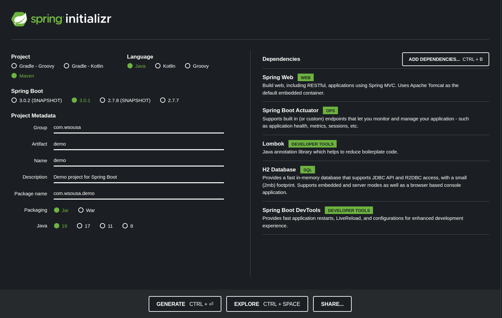
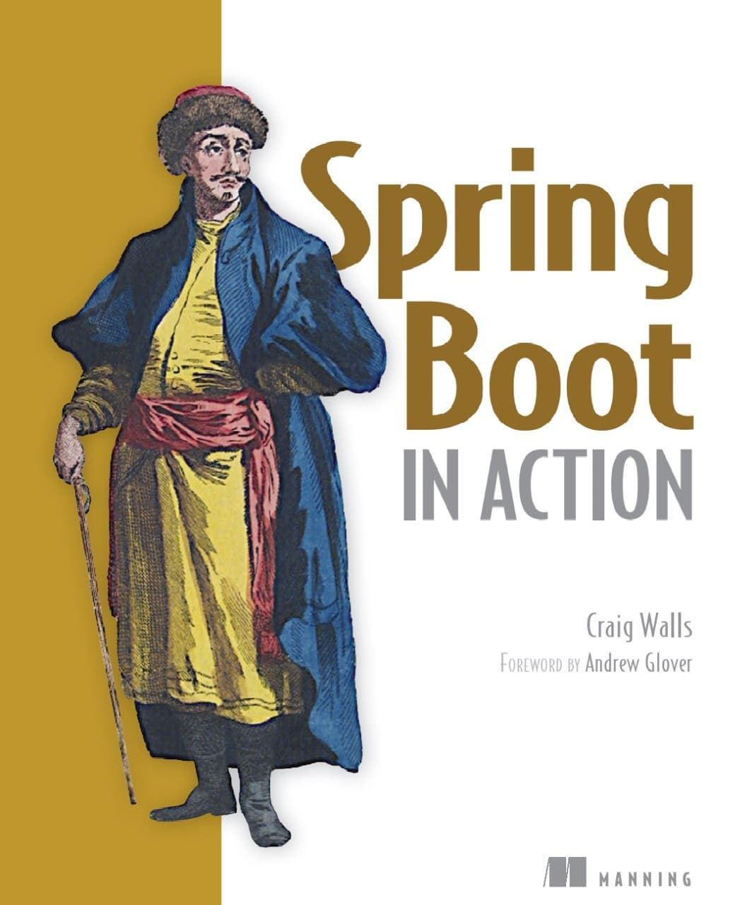
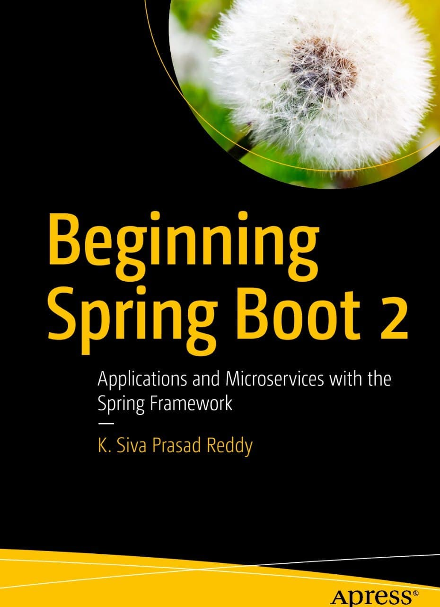
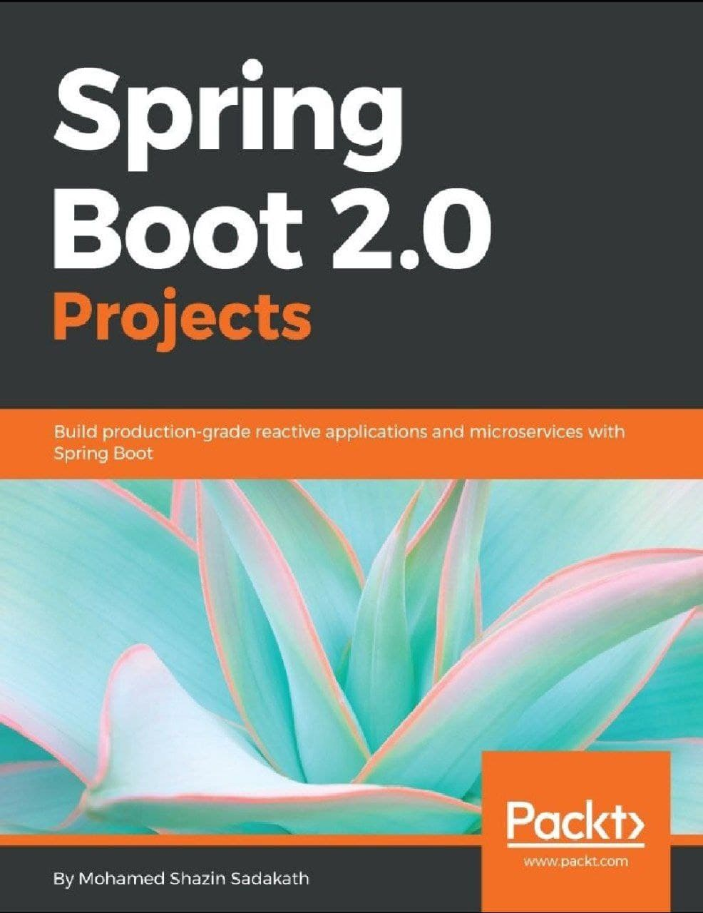
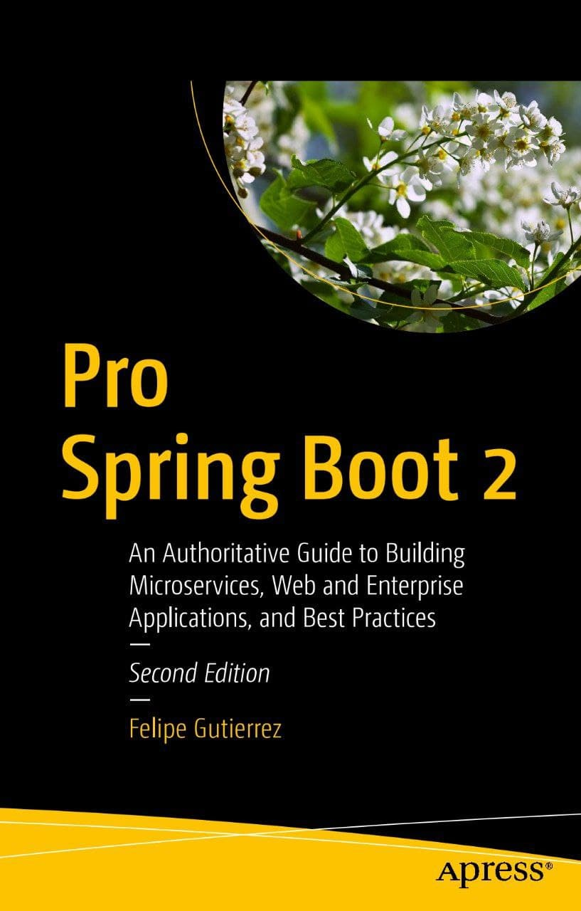
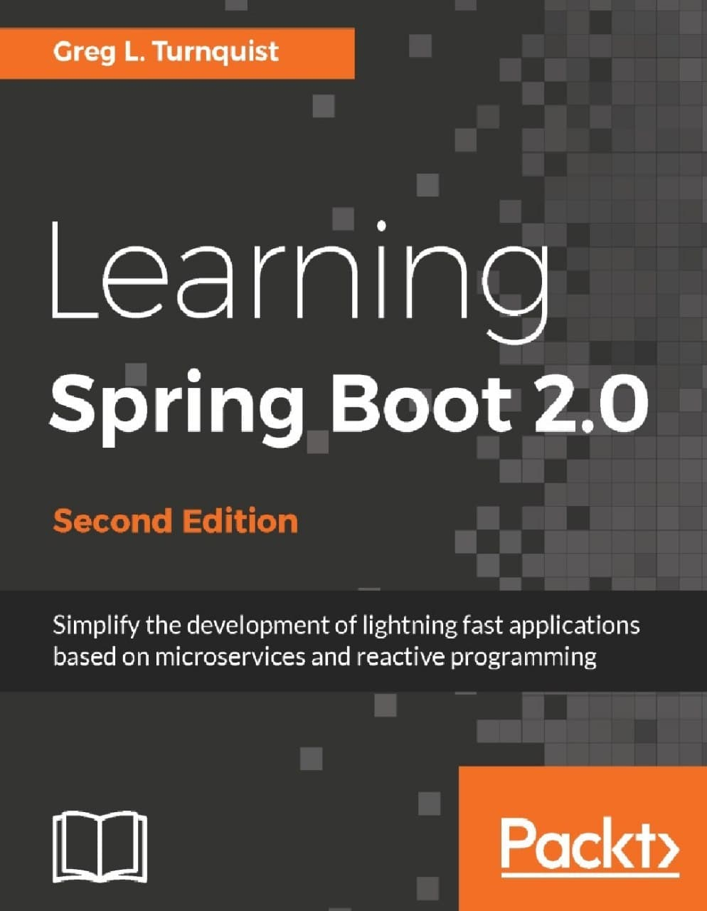
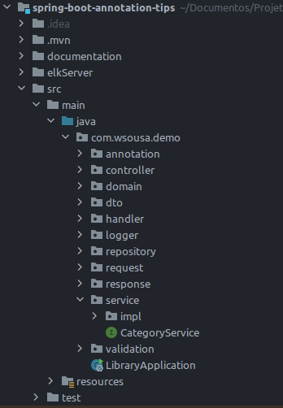

# How to start learning Spring boot.

[B: Questions About Microservices and Asynchronous Services(Rabbit, Kafka, SQS)](https://github.com/weder96/spring-boot-annotation-tips/tree/main/documentation/Part02/us-en)<br/>
[C: Security with Spring Security, Upload Download and Deploy (Cloud)](https://github.com/weder96/spring-boot-annotation-tips/tree/main/documentation/Part03/us-en)<br/>


**7. How to start Spring Boot?**<br/>
**8. What's the best way to learn Spring Boot a new framework?**<br/>
**9. But do you recommend any course in Portuguese about Spring boot?**<br/>
**10. Okay, we have books and courses, but what does the market really want from me as a high-level Developer?**<br/>
**11. Another question would be that as much as he knew was enough, had he put his hand in the dough enough?** <br/>
**12. Right, but what matters for the job market, you have to understand well about:**<br/>
**13. If you didn't have Spring, how would you use this concept (IoC and ID)?**<br/>
**14. How to study this much Spring Annotation?**<br/>
**15. But is there any material just about the annotations?**<br/>
**16. But how do I separate the packages (package) of a Spring Boot project?**<br/>
**17. But why do you have a package, with dto ?** <br/>
**18. Right, but speaking of database like Spring Boot, can you help us?**<br/>
**19. Creating a CRUD**<br/>
**20. Have you already created and know how to create an @annotation in Java ?**<br/>

-------------------------------------------------- -------------------------------------------------- -------

### **7. How to start Spring Boot?**

So how to create my first project with spring boot, to begin to understand, and yes springboot helps us, because it created a website where we can create our base application, called Spring Initializr, just access [https://start.spring.io/](https://start.spring.io/) and enter the required project information.



In my dev.to article [15 Tips to Become a Java Expert!](https://dev.to/weder96/15-tips-to-become-a-java-expert-1acj), where I quote [https://dev.to/weder96/15-tips-to-become-a-java-expert-1acj#section-10](https://dev.to/weder96/15-tips-to-become-a-java-expert-1acj#section-10)

And we must understand how [**maven**](https://mvnrepository.com/) or [**gradle**](https://gradle.org/) works, I always found the maven settings easier (xml) and with a community more active in helping, but there are many good articles about gradle(json).

I always put [lombok](https://projectlombok.org/) in my projects because it facilitates code generation issues (Getter. Setter, ToString, Slf4j, Builder) among others that will help you in several quick actions in addition to to leave the classes with only the necessary code (clean).

The cool thing here at [https://start.spring.io/](https://start.spring.io/) is that I just check the boxes and look for the libs I want and click on the **Generate** button and as if by magic your project is ready and configured for your business logic to be developed.

In the next step you can import this project to develop it in your preferred IDE example [Eclipse](https://www.eclipse.org/downloads/), [Netbeans](https://netbeans.apache.org/ ) or [IntelliJ](https://www.jetbrains.com/idea/download/#section=linux).


**_And you, which IDE do you prefer?_**

I've already used all the 3 mentioned above, but on a day-to-day basis **Intellij** gains space in organizations, so currently I only use the same one and I always like to validate how **Eclipse** is doing, which in many companies use in development.


After this theoretical part, which I'm not a fan of a lot of small talk either, I like to get my hands dirty.

-----------------------------------------------------------------------------------------------------------
### **8. What's the best way to learn Spring Boot a new framework?**

This question at the beginning of my quest for knowledge on the subject was book certainty.

Well, I'm a big fan of books unconditionally, because they show you a little bit of not only what you're learning, but the author's experience.

However, with the large number of online courses, I was divided and I always have to analyze it, as there is a course with a higher degree of learning and in most cases it becomes a better choice.

They are more interactive and you learn a lot of things in a very short time. They are also very cheap nowadays, another reason that is very relevant, even knowing that it is not an expense, it is an investment.

Some of these Spring Boot courses are spread across various places like Udemy and cost little compared to the content, by the way, if you're still a bookworm like me, here's a list.

------------------------------------------------------------------------
**01. Spring Boot in Action (Craig Walls)**



[Spring-Boot-Action-Craig-Walls](https://www.amazon.com.br/Spring-Boot-Action-Craig-Walls/dp/1617292540)


**02. Beginning Spring Boot 2 Applications and Microservices with the Spring Framework**



[BeginningSpring2](https://www.amazon.com.br/Pro-Spring-Boot-Authoritative-Microservices/dp/1484236750/ref=sr_1_2?__mk_pt_BR=%C3%85M%C3%85%C5%BD%C3%95%C3%91&keywords=Beginning+Spring+Boot+2+Applications+and+Microservices+with+the+Spring+Framework&qid=1672235731&s=books&sr=1-2&ufe=app_do%3Aamzn1.fos.6121c6c4-c969-43ae-92f7-cc248fc6181d)


**03. Spring Boot 2.0 Projects Build production-grade reactive applications and microservices with Spring Boot**



[Spring Boot 2.0 Projects Build](https://www.amazon.com.br/Spring-Projects-Mohamed-Shazin-Sadakath/dp/1789136156/ref=sr_1_1?__mk_pt_BR=%C3%85M%C3%85%C5%BD%C3%95%C3%91&crid=1BCLKVRTO3XJC&keywords=Spring+Boot+2.0+Projects&qid=1672235968&s=books&sprefix=spring+boot+2.0+projects%2Cstripbooks%2C273&sr=1-1&ufe=app_do%3Aamzn1.fos.e05b01e0-91a7-477e-a514-15a32325a6d6)


**4. Pro Spring Boot 2 An Authoritative Guide to Building Microservices, Web and Enterprise Applications, and Best Practices Second Edition**



[Pro Spring Boot 2](https://www.amazon.com.br/Pro-Spring-Boot-Authoritative-Microservices/dp/1484236750/ref=sr_1_2?__mk_pt_BR=%C3%85M%C3%85%C5%BD%C3%95%C3%91&keywords=Beginning+Spring+Boot+2+Applications+and+Microservices+with+the+Spring+Framework&qid=1672235731&s=books&sr=1-2&ufe=app_do%3Aamzn1.fos.6121c6c4-c969-43ae-92f7-cc248fc6181d)


**5. Learning Spring Boot 2.0 Greg L. Turnquist**



[Learning Spring Boot 2.0](https://www.amazon.com.br/Learning-Spring-Boot-Greg-Turnquist/dp/1786463784/ref=sr_1_1?__mk_pt_BR=%C3%85M%C3%85%C5%BD%C3%95%C3%91&crid=3I8DYUSED94ET&keywords=Learning+Spring+Boot+2.0&qid=1672236020&s=books&sprefix=learning+spring+boot+2.0%2Cstripbooks%2C217&sr=1-1&ufe=app_do%3Aamzn1.fos.e05b01e0-91a7-477e-a514-15a32325a6d6)


Each has lots of quality content.

YouTube already has good and free courses like [Spring Boot Tutorial | Full Course](https://www.youtube.com/watch?v=9SGDpanrc8U), this follows a more specific context and uses Intellij, demonstrates links and other tools to aid your understanding.

Another one that draws attention [Spring Boot Quick Start - Java Brains](https://www.youtube.com/watch?v=msXL2oDexqw&list=PLqq-6Pq4lTTbx8p2oCgcAQGQyqN8XeA1x), this second one is very didactic, but doesn't focus well on layers (package) , but it gives you an idea of well-structured layered links.

And at [UDemy](https://www.udemy.com/courses/search/?src=ukw&q=Spring+boot), here I leave a [Post-My Favorite Courses to Learn Spring Boot in 2022 — Best of Lot](https://medium.com/javarevisited/top-10-courses-to-learn-spring-boot-in-2020-best-of-lot-6ffce88a1b6e) Very detailed Spring boot courses [Udemy](https://www.udemy.com/courses/search/?src=ukw&q=Spring+boot).

-----------------------------------------------------------------------------------------------------------
### **9. But do you recommend any course in Portuguese about Spring boot?**

A free one and can be found on Youtube, are the DevDojo courses, the guys and no base are beasts, when it comes to distributing a free and quality course [Spring Boot 2 Essentials](https://www.youtube.com /watch?v=bCzsSXE4Jzg&list=PL62G310vn6nFBIxp6ZwGnm8xMcGE3VA5H)

Now if you want the Course and are not worried about spending money, you have the best and most complete [Algaworks Rest Specialist](https://cafe.algaworks.com/esr-matriculas-abertas-ago/) and The course is very strong, there are 25 modules that teach you all the content you need to be a specialist, I'm not advertising here, anyone who has taken the course knows that the cost benefit is worth it, because the course is very good.


-------------------------------------------------- -------------------------------------------------- ----------------------
### **10. Okay, we have books and courses, but what does the market really want from me as a high-level Developer?**

When I asked that question, a lot changed in my life, and thank God? a lot has changed for the better.

I started looking for vacancies and seeing what was standard among them, both backEnd and FrontEnd, as I have skills within these areas.

What caught our attention was that all the vacancies where the salaries were better and there were many people who spoke well of the contractors on [**Glassdoor**](https://www.glassdoor.com.br/member/home/index.htm), I always wanted a Java developer, who knew messaging, who knew about microservices and their design patterns or new architectures aimed at microservices (Spring Cloud).

-------------------------------------------------- -------------------------------------------------- -------
### **11. Another question will be that as much as he knew was enough, had he put his hand in the dough enough?**

We will never be able to answer this question, as it always depends on the type and size of the project, but at that moment I could answer all the questions on the subject with agility and citing examples, as I had already done several POC (Proof of Concept), and I had already passed it on the website [https://microservices.io/](https://microservices.io/) written by [Chris Richardson](https://www.oreilly.com/pub/au/2296).

How I like a good book but the one by [Chris Richardson](https://www.oreilly.com/pub/au/2296) with title [Microservices Patterns WITH EXAMPLES IN JAVA CHRIS R ICHARDSON](https://www.amazon.com.br/Microservice-Patterns-examples-Chris-Richardson/dp/1617294543) is one of those pain and "no pain no gain" ones. in [Join Community 2022](https://github.com/weder96/demoJoinCommunity). 

I highlighted some of this point with the problems we have when leaving the monolith and migrating to a micro service, and we found that if software architecture is not side side by side with the developer, the problems can be catastrophic, and if you as a developer don't understand, there are also two who will be on a boat sailing aimlessly, and anywhere is! worth it, and what we see is that these guys always leave the boat (Job change).

-----------------------------------------------------------------------------------------------------------
### **12. Right, but what matters for the job market, you have to understand well about:**

- **Object Orientation** (Pillars of OOP).
- Know the functions of each **Design Patterns (creational, structural, behavioral)**, and how to use the main examples (**Builder, Factory, Singleton, Adapter, Facade, Proxy, Observer, Chain of Responsibility, Strategy** ).
- **Collections** and the differences between **list, stack, queue and maps**, remember here not only theory you must master the subject, know all the ways to browse, each type, and how to browse maps **(ForEach, Entry, key, value)**
- Your ability to create a database (**DDL**) and (**SQL**), most of the time just understand the question about the relationship between entities.
- Main, your **ability to solve problems, simple, complex** or until that moment **almost impossible**.

Show, but so far and only work with Java and Database, being primordial, but in the labor market (Java - BackEnd) and a little more is needed, and this little bit is directed to the characteristics of who **"DOMINAS"** o Springboot.

To master the knowledge about Spring boot the first and main, and to know how the Spring that is behind, works and starts with what is IOC (Inversion of Control), (ID - Dependency Injection) and what is a [@Bean](https://medium.com/@decioluckow/explorando-bean-spring-ioc-e640c53d29a9):

When I say dominate [IoC Container(Inversion of Control)](https://www.baeldung.com/inversion-control-and-dependency-injection-in-spring), and [ID - Dependency Injection](https:// www.baeldung.com/inversion-control-and-dependency-injection-in-spring) And having the science of using these in a project, and not just using Spring using some tutorials or already getting a ready-made project. But how do I know if I understand, to know answer the question below.


-------------------------------------------------- -------------------------------------------------- -------
### **13. If you didn't have Spring, how would you use this concept (IoC and ID)?**

Well, when you master the Life Cycle and understand that a Bean is a Singleton and how to [list my application's Beans](https://www.baeldung.com/spring-show-all-beans), then you understand how to use spring annotations.

Since we quoted **annotations** you should understand all the main **annotations** of Spring, below a listing:

@Autowired <br/>
@Bean <br/>
@Component <br/>
@ComponentScan <br/>
@Configuration <br/>
@ConfigurationProperties<br/> 
@CookieValue <br/>
@CrossOrigin <br/>
@DeleteMapping <br/>
@EnableAutoConfiguration<br/> 
@GetMapping <br/>
@Lazy <br/>
@PathVariable<br/> 
@Primary <br/>
@PostMapping <br/>
@Profile <br/>
@PropertySource <br/>
@PropertySources <br/>
@PutMapping <br/>
@Qualifier <br/>
@Required <br/>
@RestController/@Controller <br/>
@Repository <br/>
@RequestBody <br/>
@RequestMapping <br/>
@RequestParam <br/>
@Scope <br/>
@Service <br/>
@SpringBootApplication<br/> 
@Value <br/>

This article has a [github repository](https://github.com/weder96/spring-boot-annotation-tips), where you can find a project whose function is to centralize the use of spring boot annotations, and their benefits , remembering that this project is in a continuous phase of studies and will be updated, with other questions and can be of help to understand the Spring Boot annotations.

-------------------------------------------------- -------------------------------------------------- -------
### **14. How to study this much Spring Annotation?**

We should always look for the first one, which is the [Official Documentation](https://docs.spring.io/spring-boot/docs/current/reference/htmlsingle/#getting-started).

But there are people who already like it and see how many questions and answers there are about [Framework SpringBoot](https://stackoverflow.com/search?q=spring+boot) on Stackoverflow (at the date of this article it had 156,175 results), but why search on Stackoverflow?

The issue here is that many seek how the community is in tune with the Framework, or if it is active in helping with problems that may happen.

Spring itself has a [github](https://github.com/spring-projects/spring-boot), with projects [templates](https://github.com/spring-projects/spring-boot/tree/main/spring-boot-project), which can help you solve some challenges along the way.

-------------------------------------------------- -------------------------------------------------- -------
### **15. But is there any material just about the annotations?**

There is a YouTube channel by [Michelli Brito](https://www.youtube.com/watch?v=Pd5tr483No0), which can help you understand all these Spring boot notes, ok, this one is in Portuguese.

Don't be sad, our friend [Java Techie](https://www.youtube.com/watch?v=htyq-mER0AE&t=927s) who never disappoints his followers brings 40+ notes, and explains their use.

I recommend that the annotation [@Transactional](https://www.baeldung.com/transaction-configuration-with-jpa-and-spring), be studied separately, as it has some very relevant and specific issues, in terms of commit, rollback between points that refers to the persistence of objects.

Now after understanding all this crazy business, let's test your skills in breaking an application's behavior into layers, Oh cool, below is a model. I said model.

Remember we don't dictate rules just one possibility, you and the architect of your application know the same, you define what you think is right, even if others say the opposite and most of the time we will get into discussions like (Batman defeats Superman ) or (Creating a dev course costs more (money) than developing something) , if you have prepared this [github](https://github.com/pilhacheia/tretadev/issues?page=2&q=is%3Aissue+is%3Aopen), has dozens of these "set the playground on fire" questions.

-------------------------------------------------- -------------------------------------------------- ---------------------
### **16. But how do I separate the packages (package) of a Spring Boot project?**



The image above is just a model, which can help you understand how to make a CRUD, you must create the first one, the border in our case will always be **controller**, here are your methods of GET, POST, PUT , DELETE and PATCH.

The **entity** or **domain** is where we place our classes that represent a table in our database.

**service** and **serviceImpl** have a very specific function the first and an interface the second and a concrete class that implements your interface, here you put the business rules.

The **repository**, keep the direct connection with the database, here you make your queries, remember the mapping is inside the **entity**, but in the repository that the queries are created.


-------------------------------------------------- -------------------------------------------------- -------
### **17. But why do you have a package with dto?**

What an excellent question, we must protect our entities, to avoid some security problems and also transfer only the necessary objects that we are looking for via DAO (Data Access Object) so we created DTO (Data Transport Object), to create means to adapt and map our entity in dtos or unlike dtos in entities, here are two libs that you need to know about [Mapstruct](https://mapstruct.org/) and [ModelMapper](http://modelmapper.org/).


-----------------------------------------------------------------------------------------------------------
### **18. Right, but speaking of database like Spring Boot, can you help us?**

you must add the dependency in the pom.xml

```
<dependency>
	<groupId>org.springframework.boot</groupId>
	<artifactId>spring-boot-starter-data-jpa</artifactId>
</dependency>
```

In case I'm using PostgreSQL I have to add it too

```
<dependency>
	<groupId>org.postgresql</groupId>
	<artifactId>postgresql</artifactId>
	<scope>runtime</scope>
</dependency>
```

and inside your application.properties


```
######## Database Configuration #########
spring.datasource.url=jdbc:postgresql://localhost:5432/postgres
spring.datasource.username=postgres
spring.datasource.password=postgres

spring.jpa.properties.hibernate.dialect=org.hibernate.dialect.PostgreSQLDialect
spring.jpa.show-sql=true
spring.jpa.properties.hibernate.format_sql=true

```

In my github there is a project [spring-boot-jpa-demo-java19](https://github.com/weder96/spring-boot-jpa-demo-java19), teaching how to upload a database in postgreSQL, docker, besides to use migrations.

We should also highlight that here it is necessary to have a knowledge of mapping entities and their relationships (OneToMany, ManyToOne, ManyToMany, OneToOne) and how to do this unidirectional or bidirectional mapping.

You must also understand about DataSource, because at times you will be working with two connections and it will be necessary to know which one will be manipulated at each moment.

In many more complex cases it is necessary to use queries with Criterion API.

The more difficult cases to handle, when creating a composite PK (Primary Key), in this case you will need to create a class specialized in manipulating this PK, being necessary to understand about mapping embeddable classes with **@Embedded and @Embeddable**.

Another point and understanding Eager Loading and Lazy Loading, as these fetching strategies for Lazy Loading or Eager Loading can return different data.

The need to use **Connection Pools** as it works, you will need to use **Hikari** which in turn is the default connection pool solution in Spring Boot.

The famous data migrations to the database, because in some moments we will be working with complex migrations and data relocation.

-------------------------------------------------- -------------------------------------------------- -------
### **19. Creating a CRUD**

Right now after studying and time for the POC (Proof of Concept), it's always good to create one, so here's that tip that everyone has to do the famous CRUD.

**C - Create** -> Create an object via Controller(**POST**), passing through the service and using the **save** method of your **Repository**.

**R - Read** -> List the data via Controller(**GET**), passing through the service and using the **findAll** method of your **Repository**

**U - Update** -> Change an object via Controller(**PUT**), going through the service and using the **save** method of your **Repository**.

**D - Delete** -> delete an Object via Controller(**DELETE**) , passing through the service and using the **delete** method of your **Repository**.

[Sample Crud with Java](https://github.com/weder96/crudApiJava).

In the Controllers layer, it is necessary to understand how Http and its verbs work (GET, POST, PUT, DELETE, PATCH), and how @RequestBody, @RequestMapping, @RequestParam, @PathVariable among others that tran=balham works in this layer.

Here we have to take a close look at some questions [CORS(Cross Origin Requests)](https://spring.io/guides/gs/rest-service-cors/), understand how HTTP caching works, know how to enable the cache with the Cache-Control header and the max-age directive.

The queries can be done with NativeQuery, but it is not indicated so you will have to learn how JPQL (Java Persistence Query Language) works, which already have the main queries and commands ready to be used, and your SQL that you can use together @ Query and remember that you can also customize the Repository, to create queries, using it.

When dealing with CRUD an important point is that you know how to create DTOs not only using frameworks like [Mapstruct](https://mapstruct.org/) and [ModelMapper](http://modelmapper.org/), but how to initialize a DTO using the query itself and also when necessary to create a RespositoryCustom, and understand about JPQL.

There's a [baeldung](https://www.baeldung.com/learn-jpa-hibernate) page, which shows you a pretty cool path in this case:

- Defining Entities
- Entity Relationships
- Identifiers
- Read Operations
- Pagination and Sorting
- Query Results
- Write Operations

Okay, but there is no top course that is worth the investment, I am not advertising again, but [Expert JPA](https://cafe.algaworks.com/ejpa-conteudo/?gclid=cjwkcaiazkqdbhaneiwaepejklzvquivquioo_l3g_ydo1egsey7) it is a complete course and you will have a deep knowledge about how to work with JPA(Java Persistence API).

Here it is good to point out that in some cases you create [audit in a table](https://www.baeldung.com/database-auditing-jpa), before changing or deleting information from your database.

At this point there are some @Annotations, which should be understood:

```
@EnableJpaAuditing
@PrePersist
@PreUpdate
@PreRemove
```

-------------------------------------------------- -------------------------------------------------- -------
### **20. Have you already created and know how to create an @annotation in Java ?**

**_Important note_** :

If your answer is no, it's ok, but the time has come to learn to understand.

At [Baeldung]() there is a nice article [Creating a Custom Annotation in Java](https://www.baeldung.com/java-custom-annotation).

That's what I like and video lessons, yes, [coding with John](https://www.youtube.com/watch?v=DkZr7_c9ry8), there's a very didactic video on the subject.

But I like the video with [Java Techie](https://www.youtube.com/watch?v=P5sAaFY3O2w&t=741s), he has it too.

Ok, but I'm not good at English, I get lost in some scenes so let's go from [O8K Group](https://www.youtube.com/watch?v=r86URVdRWpY), it explains very well.

-------------------------------------------------- -------------------------------------------------- ---------------------