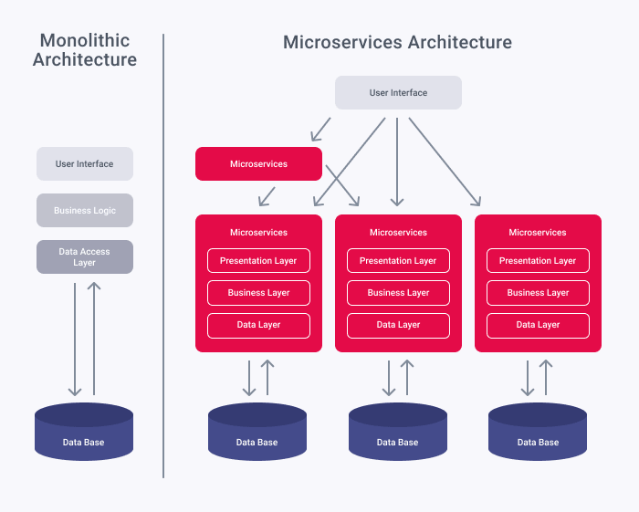
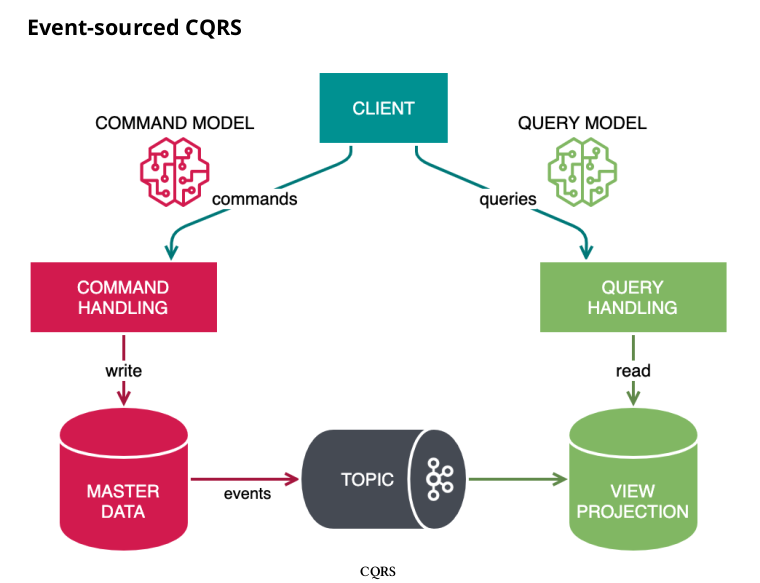

# B: Questões Sobre Microserviços e Serviços Assincronos(Rabbit, Kafka, SQS)

**21. Mas a processos complexo que exigem varios sistema integrados e trocando informações, como entender tudo isso?**<br/>
**22. Reliability**<br/>
**23. Gateway**<br/>
**24. Microserviços e sues Dilemas Classicos**<br/>
**25. Data Management**<br/>
**26. Transactional Messaging**<br/>
**27. Mas o que tem na maioria deste Design Patterns acima citado?**<br/> 

-------------------------------------------------------------------------------------------------

### **21. Mas a processos complexo que exigem varios sistema integrados e trocando informações, como entender tudo isso?**

Como pode ser analisado na imagem abaixo temos dois, tipos de arquiteturas(monoliticas e Micro Serviços)




Sim aqui temos um paradigma de programação usando microservicos, que no final e nada mais nada menos, que varios projetos SpringBoot se comunicando.


Sim e podemos ver como seria essa mesma arquiteura dentro de Service Registry, usando um API Gateway:


No meu github a um projeto [microServiceDemo](https://github.com/weder96/microServiceDemo) que detalha como vc criar uma arquitetura de micro serviço usando o Eureka Server como configurá-lo, é um projeto  simples mas te ajuda a entender partes de como configurar um projeto maven com modules, alem das configurações do [spring-cloud](https://spring.io/projects/spring-cloud)(Hoxton.SR12), porem na data deste arigo já esta na V2022.0.0, devido a versão que do [Spring boot](https://spring.io/projects/spring-boot)(2.3.3.RELEASE), porem na data deste artigo já esta na V3.0.1.


A outros ponto a ser analisados nesse projeto pois dentro do Projeto [Order](https://github.com/weder96/microServiceDemo/tree/main/order), trabalhamos com as configurações @FeignClient[openfeign](https://spring.io/projects/spring-cloud-openfeign), que te auxilia na comunicação entre microserviços.

Outro ponto e que no projeto [Delivery](https://github.com/weder96/microServiceDemo/blob/main/delivery/src/main/java/com/wsousa/delivery/http/clients/AccoutingWebClient.java),usamos o WebCLient para fazer a comunicação.


### **22. Reliability**

Conceito de [circuit-breaker](https://microservices.io/patterns/reliability/circuit-breaker.html)


### **23. Gateway**

E no projeto [Gateway](https://github.com/weder96/microServiceDemo/blob/main/gateway/pom.xml), para mapear as chamadas aos microserviços.


```
<dependency>
    <groupId>org.springframework.cloud</groupId>
    <artifactId>spring-cloud-starter-netflix-zuul</artifactId>
</dependency>
```


### **24. Microserviços e sues Dilemas Classicos**

Sempre gosto de citar [Alberto Souza](https://github.com/asouza/pilares-design-codigo/commits?author=asouza), no github dele a um projeto [pilares-design-codigo](https://github.com/asouza/pilares-design-codigo) que sempre uso como fonte para evoluir, como desenvolvedor, e dois de seus exemplos ele cita:

_"Toda indireção aumenta a dificuldade de entendimento da aplicação como um todo, ela precisa merecer existir. Ou seja, precisa ajudar a distribuir a carga intrínseca pelo sistema."_

_"Você precisa entender o que está usando e olhar sempre o lado negativo de cada decisão."_

Aqui entra um ponto muito relevante quando estamos trabalhando com microservicos, o site [https://microservices.io/](https://microservices.io/), já começa com os The Patterns, isso significa que quando lemos essa palavra alguém já passou muita raiva e criou algo pra resolver(Isso o que fazemos, resolvemos problemas usando a programação).

A mais o que tem nas citações acima, aqui sim todos os procedimentos dentro de microserviços tem que ser analisado os pontos negativos, pois aqui o trace, e as soluções são proporcionais as suas indireções, e quanto mais tiver mais será dificil entender o todo, mais problemas surgirão no decorrer do desenvolvimento, e cuidado a uma galera que vai defender seu ponto de vista e são bons em retorica, mas e inversamente proporcional quando tem que codificar, guarde essa frase abaixo:


_"Falar e fácil me mostre o código"_

E lembre se vc der a direção em algo que vc acredita então considere a seu ponto de vista como feito, pois todos vão se basear nas suas ideias e ações e vão te ajudar a finalizar o caso de uso pretendido, pois só existe um objetivo entregar valor ao cliente, e aqui que cito mais um pilar.

_"A prioridade máxima é funcionar de acordo com o caso de uso. Beleza e formosura não dão pão nem fartura."_


Voltamos ao Patterns de microserviços, aqui vou detalhar 2(dois) o **Data Management** e o **Transactional Messaging**, pois na maioria dos casos algumas soluções vão passar por messageria(RabbitMQ, ActiveMQ, SQS, KAFKA).


### **25. Data Management**

[Database per Service](https://microservices.io/patterns/data/database-per-service.html)

[Shared database](https://microservices.io/patterns/data/shared-database.html)

[API Composition](https://microservices.io/patterns/data/api-composition.html)

[Saga](https://microservices.io/patterns/data/saga.html)

[CQRS](https://microservices.io/patterns/data/cqrs.html)

[Domain event](https://microservices.io/patterns/data/domain-event.html)

[Event sourcing](https://microservices.io/patterns/data/event-sourcing.html)

### **26. Transactional Messaging**

[Transactional outbox](https://microservices.io/patterns/data/transactional-outbox.html)

[Transaction log tailing](https://microservices.io/patterns/data/transaction-log-tailing.html)

[Polling publisher](https://microservices.io/patterns/data/polling-publisher.html)


### **27. Mas o que tem na maioria deste Design Patterns acima citado?** 

Nos patterns acima citados temos alguns que usam processos assincronos, ou seja esperam um **produtor(publish)** e  **subscribe(consumidor)**, que no caso pode ser outra aplicação ou somente um **listener(ouvinte)**, que ao receber o comando dispara fechando o processo, além de também como tudo que fazemos pode haver falhas e devem ter seus retry ou filas de DQL(dead-letter queues), como serviços cloud como acima citado o SQS da AWS.

Não tem como fugir vc terá que conhecer como esse processo funciona, eu primeiramente subi um **RabbitMQ** com o **Docker**(este vai ajudar muito seu crescimento), então posteriormente tive que lidar com **Kafka** e seu estilo de trabalhar com mensageria.

Eu vou ser sincero da trabalho mas fica muito bonito e bom depois de pronto.

Quando eu li o livro Effective Kafka: A Hands-On Guide, do Autor [Emil Koutanov](https://www.amazon.com.br/Emil-Koutanov/e/B08SLDWLBG%3Fref=dbs_a_mng_rwt_scns_share), cara ele deu show neste livro, parece que tudo fica mais simples e compreensivel.


[Effective Kafka: A Hands-On Guide to Building Robust and Scalable Event-Driven Applications with Code Examples in Java](https://www.amazon.com.br/Effective-Kafka-Hands-Event-Driven-Applications-ebook/dp/B0861WN4YS)

Vou colocar duas imagens onde ele mostra como funciona um publish/subscribe(Produtor/Consumidor):


E como funciona a arquitetura CQRS, definida nos padrões **Data Management**



