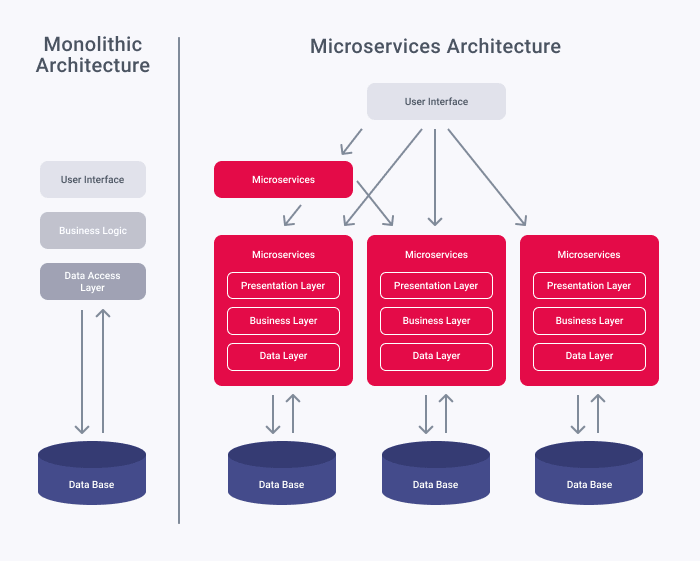
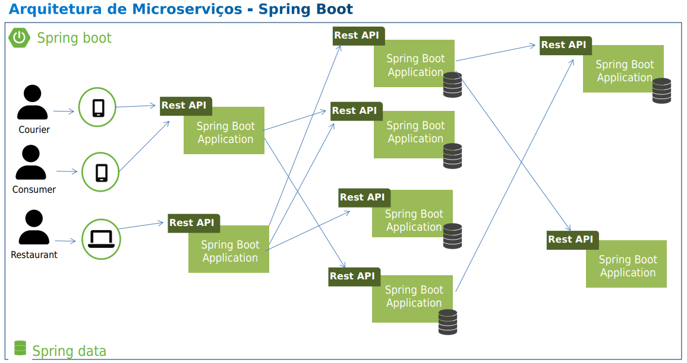
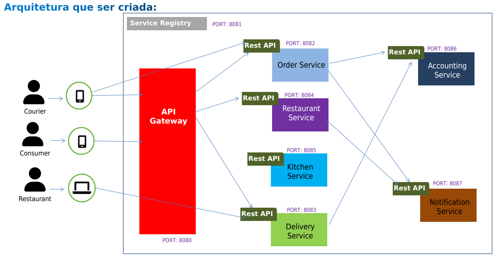
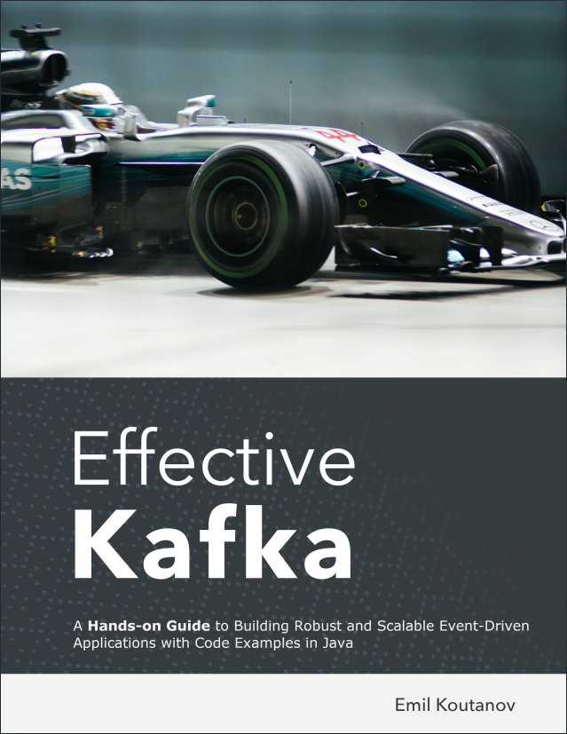
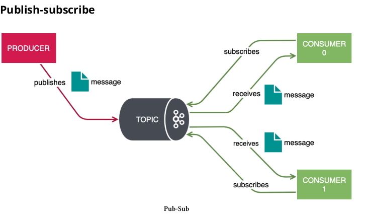
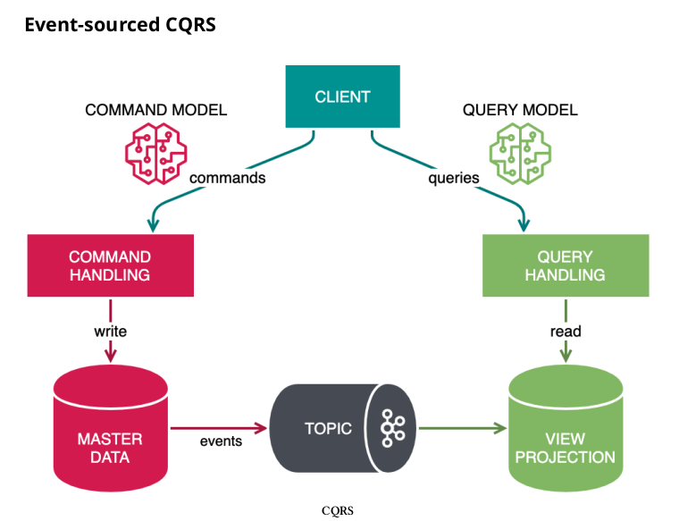
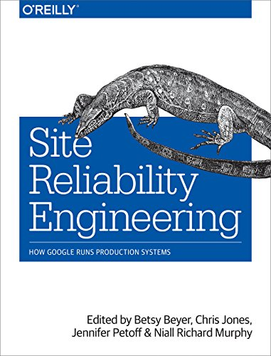
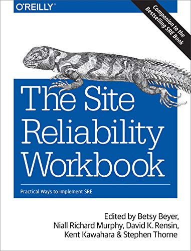
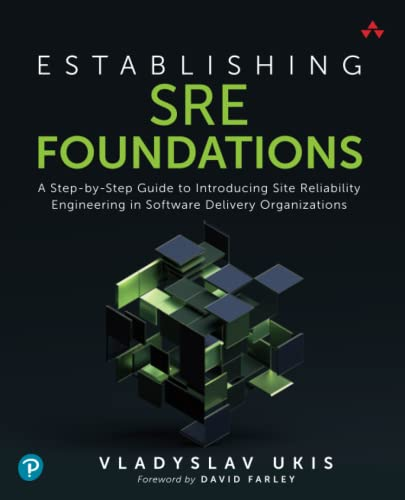

# B: Questions About Microservices and Asynchronous Services (Rabbit, Kafka, SQS)

[A: How to start learning Spring boot](https://github.com/weder96/spring-boot-annotation-tips/tree/main/documentation/Part01/us-en)<br/>
[C: Security with Spring Security, Upload Download and Deploy (Cloud)](https://github.com/weder96/spring-boot-annotation-tips/tree/main/documentation/Part03/us-en)


**21. But complex processes that require several integrated systems exchanging information, how to understand all this?**<br/>
**22. Reliability**<br/>
**23. Gateway**<br/>
**24. Microservices and their Classic Dilemmas**<br/>
**25. Data Management**<br/>
**26. Transactional Messaging**<br/>
**27. But what is in most of these Design Patterns mentioned above?**<br/>
**28. Observability with Spring Boot**<br/>

-------------------------------------------------- -----------------------------------------------

### **21. But complex processes that require several integrated systems exchanging information, how to understand all this?**

As can be seen in the image below, we have two types of architectures (monolithic and Micro Services)




Yes, here we have a programming paradigm using microservices, which in the end is nothing less than several SpringBoot projects communicating with each other.



Yes, and we can see what that same architecture would look like inside Service Registry, using an API Gateway:



On my github there is a project [microServiceDemo](https://github.com/weder96/microServiceDemo) that details how you create a microservice architecture using Eureka Server how to configure it, it's a simple project, but it helps you to understand parts of how to configure a maven project with modules, in addition to [spring-cloud](https://spring.io/projects/spring-cloud)(Hoxton.SR12) settings, but at the date of this article it is already in V2022 .0.0, due to the version of [Spring boot](https://spring.io/projects/spring-boot)(2.3.3.RELEASE), but at the date of this article it is already at V3.0.1.


Another point to be analyzed in this project, because in the [Order](https://github.com/weder96/microServiceDemo/tree/main/order) Project, we work with the @FeignClient[openfeign](https://spring .io/projects/spring-cloud-openfeign), which helps you communicate between microservices.

Another point is that in the [Delivery](https://github.com/weder96/microServiceDemo/blob/main/delivery/src/main/java/com/wsousa/delivery/http/clients/AccoutingWebClient.java) project, we use the WebCLient to do the communication.


### **22. Reliability**

Concept of [circuit-breaker](https://microservices.io/patterns/reliability/circuit-breaker.html)


### **23. Gateway**

And in the [Gateway](https://github.com/weder96/microServiceDemo/blob/main/gateway/pom.xml) project, to map calls to microservices.

```
<dependency>
     <groupId>org.springframework.cloud</groupId>
     <artifactId>spring-cloud-starter-netflix-zuul</artifactId>
</dependency>
```

### **24. Microservices and their Classic Dilemmas**

I always like to quote [Alberto Souza](https://github.com/asouza/pilares-design-codigo/commits?author=asouza), on his github to a project [pilares-design-codigo](https:// github.com/asouza/pilares-design-codigo) that I always use as a source to evolve, as a developer, and two of his examples he cites:

_"Any indirection increases the difficulty of understanding the application as a whole, it needs to deserve to exist. That is, it needs to help distribute the intrinsic load throughout the system."_

_"You need to understand what you are using and always look at the negative side of each decision."_

Here comes a very relevant point when we are working with microservices, the site [https://microservices.io/](https://microservices.io/), already starts with The Patterns, this means that when we read this word someone A lot of anger has already passed and created something to solve (That's what we do, we solve problems using programming).

Plus what's in the quotes above, here yes all procedures within microservices have to be analyzed the negative points, because here the trace, and the solutions are proportional to their directions, and the more there are, the more difficult it will be to understand the whole, more problems will arise during development, and beware of people who will defend their point of view and are good at rhetoric, but it is inversely proportional when they have to code, save this sentence below:


_"Speak and easy show me the code"_

And remember, if you give direction to something you believe in, then consider your point of view as done, because they will all be based on your ideas and actions and will help you to finalize the intended use case, because there is only one objective to deliver customer value, and here I mention one more pillar.

_"The top priority is to work according to the use case. Beauty and beauty do not give bread or plenty. "_


Back to Microservices Patterns, here I will detail 2(two) **Data Management** and **Transactional Messaging**, because in most cases some solutions will go through messaging (RabbitMQ, ActiveMQ, SQS, KAFKA).


### **25. Data Management**

[Database per Service](https://microservices.io/patterns/data/database-per-service.html)

[Shared database](https://microservices.io/patterns/data/shared-database.html)

[API Composition](https://microservices.io/patterns/data/api-composition.html)

[Saga](https://microservices.io/patterns/data/saga.html)

[CQRS](https://microservices.io/patterns/data/cqrs.html)

[Domain event](https://microservices.io/patterns/data/domain-event.html)

[Event sourcing](https://microservices.io/patterns/data/event-sourcing.html)

### **26. Transactional Messaging**

[Transactional outbox](https://microservices.io/patterns/data/transactional-outbox.html)

[Transaction log tailing](https://microservices.io/patterns/data/transaction-log-tailing.html)

[Polling publisher](https://microservices.io/patterns/data/polling-publisher.html)

------------------------------------------------------------------------------------------------

### **27. But what is in most of these Design Patterns mentioned above?**

In the patterns mentioned above, we have some that use asynchronous processes, that is, they expect a **producer(publish)** and **subscribe(consumer)**, which in this case can be another application or just a **listener(listener)* *, which when receiving the command triggers closing the process, in addition to also like everything we do there may be failures and must have their retry or DQL queues (dead-letter queues), such as cloud services as mentioned above the AWS SQS.

There's no way around it, you'll have to know how this process works, I first uploaded a **RabbitMQ** with **Docker** (this one will help your growth a lot), then later I had to deal with **Kafka** and your style of working with messaging.

I'll be honest about the work but it looks very nice and good after it's done.

When I read the book Effective Kafka: A Hands-On Guide, by the Author [Emil Koutanov](https://www.amazon.com.br/Emil-Koutanov/e/B08SLDWLBG%3Fref=dbs_a_mng_rwt_scns_share), man it gave a show in this book, it seems that everything becomes simpler and more understandable.



[Effective Kafka: A Hands-On Guide to Building Robust and Scalable Event-Driven Applications with Code Examples in Java](https://www.amazon.com.br/Effective-Kafka-Hands-Event-Driven-Applications-ebook /dp/B0861WN4YS)

I'll put two images where it shows how a publish/subscribe(Producer/Consumer) works:




And how the CQRS architecture, defined in the **Data Management** standards, works




-------------------------------------------------- -----------------------------------------------
### **28. Observability with Spring Boot**

Due to the great possibility of using microservices, the Galerinha do SRE (Site Reliability Engineering), which currently plays a fundamental role in tracking and control, as applications can be affected at any time with a large amount of access, a point of microservices stop and affect everything.

Spring has an observability team that has been working on adding observability support to Spring applications for some time now and each release is evolving.

[**But what is observability?**](https://spring.io/blog/2022/10/12/observability-with-spring-boot-3)

In our understanding, it is "how well you can understand the internals of your system by examining its outputs". We believe that the interconnection between metrics, logging and distributed tracing gives you the ability to reason about the state of your system to debug exceptions and latency in your applications. You can watch more about what we think about observability in this episode of Enlightning with Jonatan Ivanov.

Now it's time to add observability-related features!

In my github there is a project [SpringBootActuatorPrometheus](https://github.com/weder96/SpringBootActuatorPrometheus) that I created for studies only with this question:

**Metrics**

For **Micrometer with Prometheus** metrics,
**Tracking**

For Context Propagation Tracing with **Micrometer** Tracing, we need to choose a **tracer** bridge (tracer is a library used to handle the lifecycle of a span).


**Historic**

Since we have Micrometer Trace in the classpath, the logs are automatically correlated (that is, they contain a unique trace identifier). Now we need to upload the logs. For this demo, we sent them to Grafana Loki. We can achieve this by adding the com.github.loki4j:loki-logback-appender dependency.

I advise you to read 3 books on the subject:

-------------------------------------------------------------------------------------

**01. Site Reliability Engineering: How Google Runs Production Systems (English Edition)**



[Site Reliability Engineering: How Google Runs Production Systems (English Edition)](https://www.amazon.com.br/Site-Reliability-Engineering-Production-Systems-ebook/dp/B01DCPXKZ6/ref=sr_1_2?adgrpid=81898274395&gclid=CjwKCAiA2fmdBhBpEiwA4CcHzSqc8YqyZem-1M7b0Lvw16Whn2XGeNZQ0iXct6PGSeozl9BRv_wKKxoCGYQQAvD_BwE&hvadid=425982498844&hvdev=c&hvlocphy=1031430&hvnetw=g&hvqmt=b&hvrand=11454883084154792729&hvtargid=kwd-299036721296&hydadcr=5620_11235101&keywords=google+sre&qid=1673464129&sr=8-2)

-------------------------------------------------------------------------------------

**02. The Site Reliability Workbook: Practical Ways to Implement SRE**



[The Site Reliability Workbook: Practical Ways to Implement SRE](https://www.amazon.com.br/Site-Reliability-Workbook-Betsy-Beyer/dp/1492029505/ref=sr_1_3?adgrpid=81898274395&gclid=CjwKCAiA2fmdBhBpEiwA4CcHzSqc8YqyZem-1M7b0Lvw16Whn2XGeNZQ0iXct6PGSeozl9BRv_wKKxoCGYQQAvD_BwE&hvadid=425982498844&hvdev=c&hvlocphy=1031430&hvnetw=g&hvqmt=b&hvrand=11454883084154792729&hvtargid=kwd-299036721296&hydadcr=5620_11235101&keywords=google+sre&qid=1673464230&sr=8-3&ufe=app_do%3Aamzn1.fos.db68964d-7c0e-4bb2-a95c-e5cb9e32eb12)


-------------------------------------------------------------------------------------

**03. Establishing SRE Foundations A Step-by-Step Guide to Introducing Site Reliability Engineering in Software Delivery Organizations**



[https://www.amazon.com/Establishing-Foundations-Step-Step-Organizations/dp/0137424604](https://www.amazon.com/Establishing-Foundations-Step-Step-Organizations/dp/0137424604)


