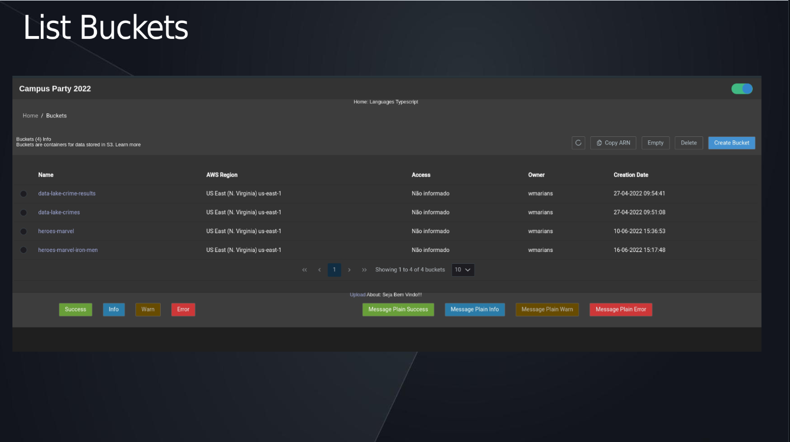
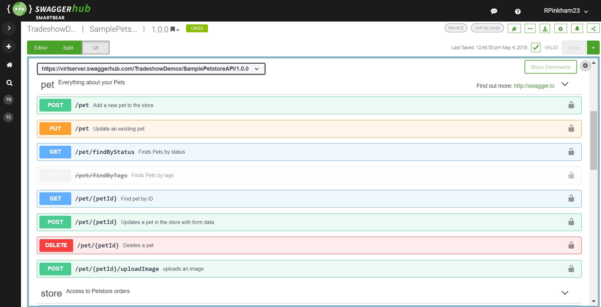

# C: Tratamento de Exceções, Segurança com Spring Security, Exceptions e Validações, Upload, Download e Deploy (Cloud)

[A: Como começar a aprender o Spring boot](https://github.com/weder96/spring-boot-annotation-tips/tree/main/documentation/Part01) 
[B: Questões Sobre Microserviços e Serviços Assincronos(Rabbit, Kafka, SQS)](https://github.com/weder96/spring-boot-annotation-tips/tree/main/documentation/Part02) 

**29. Tratamento de Exceções com SpringBoot**  
**30. Validações com Bean Validation SpringBoot**
**31. Testes de Integrações**
**32. Segurança com Spring Security, OAuth2, Saml e JWT**  
**33. Upload e download de arquivos** 
**34. Documentação com OpenAPI(Swagger)** 
**35. Deploy em produção na nuvem da Amazon** 
**36. Conclusão** 

-----------------------------------------------------------------------------------------------------------
### **29. Tratamento de Exceções com SpringBoot**

Aqui vamos a uma parte essencial, que e o tratamento de exceções, quando estamos trabalhando com API, deixamos parametros, que nem sempre vai funcionar como esperado o que vai gerar erros na nossa API,  

Neste caso a algumas formas de resolver isso, uma e o lançando exceções customizadas anotadas com @ResponseStatus, outro ponto que gosto e também e essencial e vc ter suas exceptions personalizadas, pois elas te ajudam nos rastreamento de erros da aplicação, no meu caso sempre tenho BusinessException e SystemException.

Mas como sabemos o Springboot tem um controlador de exceções chamado @ExceptionHandler, onde ao usar ele junto @ControllerAdvice, podemos tratar exceptions em nível global, e vc pode também customizar essas exceptions.

Em um nível mais baixo ainda  temos a possibilidade de Habilitar erros na desserialização de propriedades inexistentes ou ignoradas, fazendo o tratando PropertyBindingException na desserialização.

-----------------------------------------------------------------------------------------------------------

### **30. Validações com Bean Validation SpringBoot**

As vezes precisamos criar validações para verificarmos se algum campo que foi passado para aplicação atende a regra de negocio ou se o mesmo existe, neste caso temos um auxilio que são validações com **Bean Validation**, podemos adicionar constraints e validar no proprio controller com **@Valid**, e ainda realizar o tratando exception de violação de constraints desta  validação.

Aqui a algumas questões legais como validação em as associações de uma entidade em cascata, vc pode  convertendo grupos de constraints para validação em cascata com **@ConvertGroup**, além de poder customizar mensagens de validação.

-----------------------------------------------------------------------------------------------------------

### **31. Testes de Integrações**

Falar em teste como diz o ditado e "chover no molhado", precisamos sempre estar afiado em realizar testes, aqui o QA ou também conhecido testers, o cara que sempre será seu melhor amigo(não contém ironia, ele vai te levar a ser melhor, a cada sprint).
Ao rodarmos um teste de integração com Spring Boot, sempre pensamos no **JUnit e AssertJ**, mas temos uma possibilidade enormes quando estamos trabalhando com testes, abaixo uma listagem com alguns que podem te ajudar e possivelmente seu proximo emprego pode ter um deles ou mais , já implantado ou esperando vc para fazer isso.

1. JUnit
2. REST Assured
3. Mockito
4. Selenium
5. TestNG
6. Spock Framework
7. Cucumber
8. Spring Test
9. DBUnit
10. Testcontainers
11. AssertJ
12. Awaitility
13. Wiser
14. Memoryfilesystem
15. WireMock

Poderia aqui falar sobre muitos daria até varios Post , sobre o assunto, mas isso e outro momento.

-----------------------------------------------------------------------------------------------------------
### **32. Segurança com Spring Security, OAuth2, Saml e JWT**

A segurança em aplicações e uma parte sempre complexa e também devido a grande diversidades de soluções, na antiguidade de programação, a uns 12 anos atras nos Seguiamos o JAAS (Java Authentication and Au­thorization Service) um nome bonito, porém a complexidade de se trabalhar com essa solução e falta de uma documentação.

Já em 2008 o [Spring Security](https://spring.io/projects/spring-security) já estava evoluindo e já se via programadores buscando essa solução, e na sua versão 4.0.0, em 2015, já estava sendo aplicado na maioria das aplicações, ou mesmo estavam sendo criado mais tutorias, neste ano o [Spring Security](https://spring.io/projects/spring-security) a sua versão atingiu a versão [6 .0.1](https://docs.spring.io/spring-security/reference/index.html), e tem as maiores atualizações desde a versão 4.0.0.

Com cada mais aplicações evoluindo nas questões de segurança, pois hoje temos varias ferramentas(Nexus, Fortify) que te ajudam a realizar um discovery na sua aplicação, procurando possiveis falha que já são conhecidas e podem ser usada para corromper sua aplicação, essa falhas são amplamente divulgadas e muitas vezes corrigidas, porem a sua aplicação ainda não atualizou para essa versão.

Hoje e necessário o programador ter uma visão abrangente em torno de questões de segurança, primeiro entender como funciona o [JWT(JSON Web Token)](https://www.bezkoder.com/spring-boot-jwt-mysql-spring-security-architecture/) e também como os [Filters](https://www.baeldung.com/spring-boot-add-filter) do Spring Boot funcionam.

Neste ponto alguns detalhes já fazem parte do seu entendimento, mas as formas de Logar estão cada vez mais evoluindo e as organizações já querem aproveitar cadastro pre existente [keycloak](https://www.keycloak.org/), ou até login que acesse serviços de diretórios LDAP(Lightweight Directory Access Protocol).

No meu [github](https://github.com/weder96/spring-boot-keycloak) , há um projeto [spring-boot-keycloak](https://github.com/weder96/spring-boot-keycloak), onde trabalhamos com uma autenticação e autorização usando o Spring Boot e Keycloak, lembrando que aqui usamos o [docker-compose](https://docs.docker.com/compose/install/) para subir o mysql e keyCloak.

Vc deverá entender com trabalhar com OAuth2 e com JWT e controle de acesso, 

E como funcionam  os algoritmmos de  criptrografia que geram tokens JWT, como algoritmo simétrico (HMAC SHA-256), ou assinando o JWT com um algoritmo assimétrico (RSA SHA-256),  e como o spring Security te ajuda a verificar autenticação de  usuário com dados do banco de dados.

Vc pode Adicionar Claims públicas no Payload do JWT (nome do usuário) e entender com pode planejar uma topologia dos grupos e permissões do sistema, que ao ser usado com o Method Security pode Restringindo acesso a API com uso @PreAuthorize e SpEL

-----------------------------------------------------------------------------------------------------------
### **33. Upload e download de arquivos**

Quando estamos criando um sistema na maioria das vezes vamos nos deparar com manipulação de imagens ou arquivos, desde somente transferir, em outros casos ate gerar ou converter de formato tipo docx para PDF, ou de pdf para imagens, e as formas de salvar essas imagens, atualmente passam por armazenamento na nuvem(AWS, AZURE, Google Cloud), existem outros, mas vamos ficar somente, neste vou me basear na AWS e seu serviço S3(Simple Servive Storage), e você estará em momento de que está trabalhando em um sistema que já tem uma arquitetura pronta, e agora se depara com um requisito de upload e download e salvar o mesmo na AWS. 

Em que você precisa fazer o upload via API e Salvar na AWS S3, no meu github [https://github.com/weder96/aws-image-upload-wsousa](https://github.com/weder96/aws-image-upload-wsousa), que e um projeto que tem frontEnd e backEnd explicando como você conecta via [CDK](https://aws.amazon.com/pt/cdk/), e que tem a finalidade de ser um demo, usando o frontEnd você tem um clone do controle de Arquivos do S3 da AWS.

Este projeto foi uma apresentação na Campus party 2022, onde demostramos como e simples o uso do CDK e Springboot , para manipular arquivos na AWS S3.

Porem manipulação de arquivos e um pouco mais abrangente aqui estamos falando em arquivos pequenos e somente transporte, mas a questões como transportar centenas de arquivos(multipart) onde usamos os spring batch, e outros pontos que complica, mas entender a base de como manipular arquivos com Spring boot , já te da, um ponto de início a entender essa disciplina que se usa muito na nossa área.

-----------------------------------------------------------------------------------------------------------
### **34. Documentação com OpenAPI(Swagger)**

O famoso Swagger, como estamos trabalhando com APIS, e sempre bom documentar, pois, quem cria e quem usa e quem faz a integrações, neste modelo de ágil são sempre profissionais diferentes, no caso o frontEnd e BackEnd.

Esta imagem acima e somente um modelo que nos mostra quais parâmetros e quais urls estão disponíveis para ser usada no projeto, então na maioria dos projetos o swagger vai ser ativado e solicitado pela equipe de análise e regras de negócio.

-----------------------------------------------------------------------------------------------------------
### **35. Deploy em produção na nuvem da Amazon**

Aqui vem sempre a questão, como desenvolvedor por que tenho que saber fazer deploy na nuvem? 

Pois as equipes possuem uma pessoa especializada em configurar o deploy, sim. Talvez, nem sempre. 

Algumas equipes costumam a ter um profissional de Cloud, mas na sua maioria são profissionais cloud e não tem domínio sobre o Springboot e Java e Servidores(Tomcat, Jetty, JBoss, WildFly, WebSphere, Glassfish), que por sua vez também e muita coisa para aprender, então quando conhecemos podemos ser uteis e ajudar a destravar alguns impedimentos que pode ocorrer.

-----------------------------------------------------------------------------------------------------------
### **36. Conclusão**

**Ser um profissional Spring e Springboot**, usando java e uma tarefa que exige disciplina e também muita prática, trabalhar em grandes empresas e ter salários bons e uma busca de todos nos profissionais, não caiam nas conversas de 6 meses, você será um JEDI, em 6 meses você se tornará um bom excelente profissional.

**Tem alguns que dizemos que nasceu para isso**, outros têm mais dificuldades **porem com disciplina e foco**, logo alcançará seus objetivos, mas **tenha paciência**, defina **metas alcançáveis**, nunca alimente seu ego, o perfeito e inimigo do bom e não se distraia no meio do caminho.

Outro ponto, **não queira ser Sênior de 2 anos ou 3 anos de experiência**, isso te atrapalha no seu crescimento deixa as coisas acontecerem naturalmente. 

Sempre busque conhecimento, essa questão e complexa, ao tocarmos neste ponto aqui e muito abstrato, tudo vai depender da equipe que você trabalha ou às vezes até do projeto, e a capacidade de absorção e entendimento, porem muito se deparam com outros desafios e ali descobrem o que na minha opinião não e algo ruim se deparam com desafios onde suas habilidades às vezes ainda não alcançaram.

Quando se deparam com esses momentos, de um passo, atras e pega mais velocidade **(conhecimento, cursos, provas conceito entendimento da documentação, vídeos no Youtube entre outros)**. 

Tire um tempo para descansar, sair com colegas, familiares e durma bem (8 horas por noite), as melhores soluções aparecem nos momentos mais estranhos, **deixe sempre um caderninho e caneta ao lado de sua cama**, anote algo que você pensou, não tente ir resolver algo no **momento da descoberta**, pare e pense melhor e só **resolva no momento certo**.

Se você trabalha casa tente tenha um local que te lembre um escritório, finais de semana, quando não estiver fazendo nada **tranque esse local** e lembre que **você precisa descansar**.

O CEO da empresa que trabalho disse algo que sempre me deixa pensativo, **"vista a sua camisa nunca a da empresa"**, aparentemente e algo estranho de se dizer, mas ele explicando você consegue ver que e algo que gera resultados dos dois lados, para você que sera um profissional melhor e para empresa, pois ela tera você no melhor nivel de resolução de problemas sempre.

Tente buscar conhecimentos crie a cada passo, **suas evoluções no Github**, para você a cada dia medir como está sua evolução, e logo as **conquistas virão**, mas lembre sempre lidamos **com pessoas** e pessoas tem seu **tempo e sentimentos**, antes de **criticar ou questionar**, pense será como falaria algo sem que parece ofensivo, sempre se coloque no **lugar da outra pessoa**. 

E o mais importante você **pegará códigos bons e ruins**, você trabalhara com **pessoas boas e ruins** e natural, então sempre analise qual e você dentro dessa equipe, **o que escreve códigos bons e uma pessoa ruim**, ou **o que escreve código ruins, mas e uma pessoa boa**, lembre que da para ensinar uma **pessoa a ter excelentes códigos**, mas a uma pessoa ser boa aí e um **pouco complexo**, cultive amizades, mas sem ser chato, pessoas não gostam de pessoas assim, seja proativo, mas só vá até onde conseguir ir aprenda a **dizer eu não sei**, mas amanhã me **pergunte outra vez**, e sempre a resposta será diferente.

Sobre os códigos ruins também e outro ponto a ser **analizado não conhecemos o momento** e nem a **pressão** que ocorreu naquele momento pra **entregar**, então nossas suposições são apenas **especulações**, então se for obrigado a mexer, **documente** , entenda, mas não **saia falando mal do programador**, pois existe uma frase direta e simples:

_"Falar e fácil me mostre o código"_