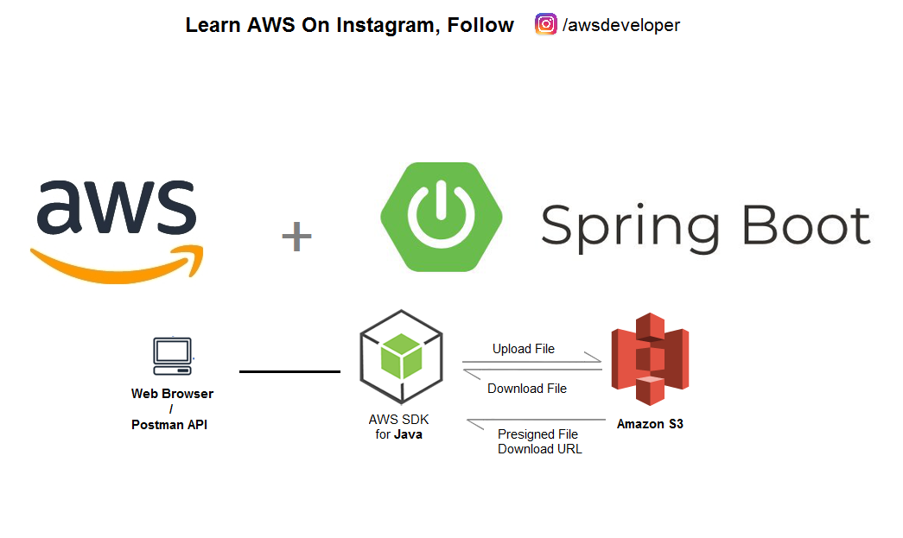
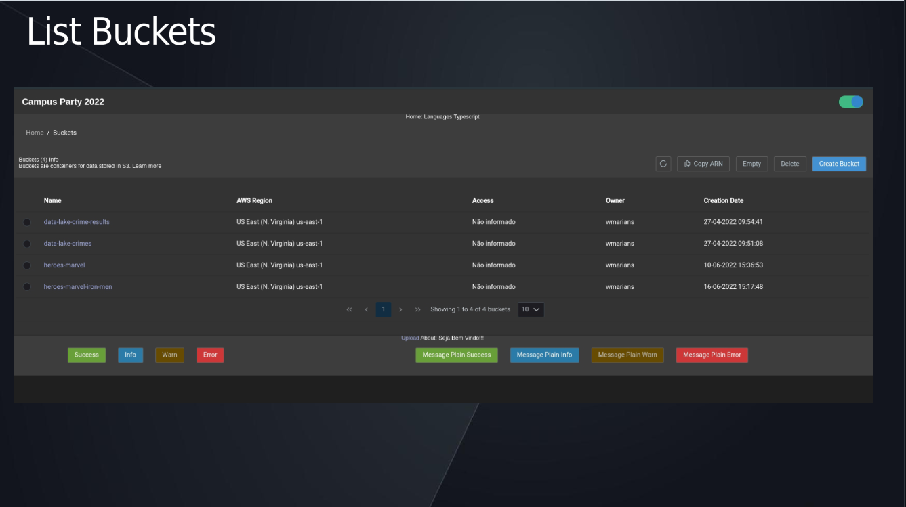
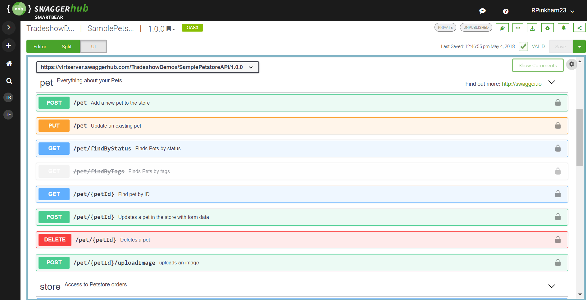

# C: Exception Handling, Spring Security, Exceptions and Validations, Upload, Download, test and Deploy (Cloud)

[A: How to start learning Spring boot](https://github.com/weder96/spring-boot-annotation-tips/tree/main/documentation/Part01/us-en) 
[B: Questions About Microservices and Asynchronous Services(Rabbit, Kafka, SQS)](https://github.com/weder96/spring-boot-annotation-tips/tree/main/documentation/Part02/us-en) 

**29. Handling Exceptions with SpringBoot**  
**30. Validations with Bean Validation SpringBoot**
**31. Integration Tests**
**32. Security with Spring Security, OAuth2, Saml and JWT**  
**33. Uploading and downloading files** 
**34. Documentation with OpenAPI(Swagger)** 
**35. Deploy to Amazon Cloud Production** 
**36. Conclusion** 

-------------------------------------------------- -------------------------------------------------- -------
### **29. Exception Handling with SpringBoot**

Here we go to an essential part, which is the handling of exceptions, when we are working with the API, we leave parameters, which will not always work as expected, which will generate errors in our API,

In this case, there are some ways to solve this, one is throwing custom exceptions annotated with @ResponseStatus, another point that I like and it is also essential and you have your custom exceptions, because they help you in tracking application errors, in my case always I have BusinessException and SystemException.

But as we know, Springboot has an exception handler called @ExceptionHandler, where when using it together with @ControllerAdvice, we can handle exceptions globally, and you can also customize these exceptions.

At a lower level, we still have the possibility of enabling errors in the deserialization of nonexistent or ignored properties, handling PropertyBindingException in the deserialization.

-------------------------------------------------- -------------------------------------------------- -------

### **30. Validations with Bean Validation SpringBoot**

Sometimes we need to create validations to verify if any field that was passed to the application meets the business rule or if it exists, in this case we have an aid that are validations with **Bean Validation**, we can add constraints and validate in the controller itself with **@Valid**, and still handle the exception of violation of constraints of this validation.

Here are some legal issues such as validating the associations of an entity in cascade, you can convert groups of constraints to validation in cascade with **@ConvertGroup**, in addition to being able to customize validation messages.

-----------------------------------------------------------------------------------------------------------
### **31. Integration Tests**

Speaking of testing as the saying goes and "rain in the wet", we always need to be sharp in carrying out tests, here the QA or also known testers, the guy who will always be your best friend (does not contain irony, he will lead you to be better , every sprint).
When running an integration test with Spring Boot, we always think of **JUnit and AssertJ**, but we have a huge possibility when we are working with tests, below is a list of some that can help you and possibly your next job may have one of them or more, already implanted or waiting for you to do it.

1. JUnit
2. REST Assured
3. Mockito
4. Selenium
5. TestNG
6. Spock Framework
7. Cucumber
8. Spring Test
9. DBUnit
10. Testcontainers
11. AssertJ
12. Awaitility
13. Wiser
14. Memoryfilesystem
15. WireMock

I could talk about many here, I would even post several, on the subject, but that is another moment.

-------------------------------------------------- -------------------------------------------------- -------
### **32. Security with Spring Security, OAuth2, Saml and JWT**

Security in applications is always a complex part and also due to the great diversity of solutions, in the antiquity of programming, about 12 years ago we follow JAAS (Java Authentication and Authorization Service) a beautiful name, but the complexity of working with this solution and lack of documentation.

Already in 2008 [Spring Security](https://spring.io/projects/spring-security) was already evolving and programmers were already looking for this solution, and in its version 4.0.0, in 2015, it was already being applied in most applications, or even more tutorials were being created, this year [Spring Security](https://spring.io/projects/spring-security) its version reached version [6 .0.1](https:/ /docs.spring.io/spring-security/reference/index.html), and has major updates since version 4.0.0.

With more and more applications evolving in terms of security, because today we have several tools (Nexus, Fortify) that help you to discover your application, looking for possible failures that are already known and can be used to corrupt your application, these failures are widely disseminated and often corrected, but your application has not yet updated to that version.

Today it is necessary for the programmer to have a comprehensive view around security issues, first to understand how the [JWT(JSON Web Token)](https://www.bezkoder.com/spring-boot-jwt-mysql-spring- security-architecture/) and also how Spring Boot's [Filters](https://www.baeldung.com/spring-boot-add-filter) work.

At this point, some details are already part of your understanding, but the forms of logging are increasingly evolving and organizations already want to take advantage of a pre-existing registration [keycloak](https://www.keycloak.org/), or even a login that Access Lightweight Directory Access Protocol (LDAP) directory services.

In my [github](https://github.com/weder96/spring-boot-keycloak) there is a project [spring-boot-keycloak](https://github.com/weder96/spring-boot-keycloak) , where we work with authentication and authorization using Spring Boot and Keycloak, remembering that here we use [docker-compose](https://docs.docker.com/compose/install/) to upload mysql and keyCloak.

You should understand how to work with OAuth2 and with JWT and access control,

And how do cryptographic algorithms that generate JWT tokens work, such as a symmetric algorithm (HMAC SHA-256), or signing JWT with an asymmetric algorithm (RSA SHA-256), and how spring Security helps you verify user authentication with database data.

You can add public Claims in the JWT Payload (user name) and understand how you can plan a topology of groups and system permissions, which when used with Method Security can Restricting API access using @PreAuthorize and SpEL

-----------------------------------------------------------------------------------------------------------
### **33. Uploading and downloading files**

When we are creating a system, most of the time we will be faced with manipulation of images or files, from just transferring, in other cases even generating or converting from a docx format to PDF, or from pdf to images, and the ways to save these images , currently they go through storage in the cloud (AWS, AZURE, Google Cloud), there are others, but let's just stay, in this one I will be based on AWS and its S3 service (Simple Servive Storage), and you will be in the moment that you are working on a system that already has a ready architecture, and now is faced with an upload and download requirement and save the same in AWS.

Where you need to upload via API and Save to AWS S3, on my github [https://github.com/weder96/aws-image-upload-wsousa](https://github.com/weder96/aws- image-upload-wsousa), which is a project that has a frontEnd and a backEnd explaining how you connect via [CDK](https://aws.amazon.com/pt/cdk/), and which is intended to be a demo , using the frontEnd you have a clone of the AWS S3 File control.

This project was a presentation at Campus party 2022, where we demonstrated how to use CDK and Springboot , to manipulate files in AWS S3.

But file handling is a little more comprehensive here we are talking about small files and only transport, but issues like transporting hundreds of files (multipart) where we use spring batch, and other points that complicate, but understanding the basis of how to handle files with Spring boot , it already gives you a starting point to understand this discipline that is used a lot in our area.

-------------------------------------------------- -------------------------------------------------- -------
### **34. Documentation with OpenAPI(Swagger)**

The famous Swagger, as we are working with APIS, it is always good to document, because who creates and who uses and who does the integrations, in this agile model there are always different professionals, in this case the frontEnd and BackEnd.

This image above is just a model that shows us which parameters and which urls are available to be used in the project, so in most projects the swagger will be activated and requested by the analysis and business rules team.

-------------------------------------------------- -------------------------------------------------- -------
### **35. Deploy to Amazon Cloud Production**

Here always comes the question, as a developer why do I have to know how to deploy in the cloud?

Because the teams have a person specialized in configuring the deploy, yes. Maybe not always.

Some teams tend to have a Cloud professional, but most are cloud professionals and do not master Springboot and Java and Servers (Tomcat, Jetty, JBoss, WildFly, WebSphere, Glassfish), which in turn is also a lot to learn, so when we know it we can be useful and help unlock some impediments that may occur.

-----------------------------------------------------------------------------------------------------------
### **36. Conclusion**

**Being a Spring and Springboot professional**, using java is a task that requires discipline and also a lot of practice, working in big companies and having good salaries and a search for all professionals, don't fall for the 6 month conversations, you will be a JEDI, in 6 months you will become a good excellent professional.

**There are some that we say were born for this**, others have more difficulties **but with discipline and focus**, you will soon reach your goals, but **be patient**, set **achievable goals**, never feed your ego, the perfect and enemy of the good and don't get distracted halfway through.

Another point, **don't want to be a Senior with 2 years or 3 years of experience**, it gets in the way of your growth, lets things happen naturally.

Always seek knowledge, this issue is complex, when we touch on this point here and it is very abstract, everything will depend on the team you work with or sometimes even the project, and the capacity for absorption and understanding, but many are faced with other challenges and there they discover what in my opinion is not a bad thing, they face challenges where their skills sometimes haven't reached yet.

When faced with these moments, take a step back and pick up speed **(knowledge, courses, concept tests, understanding of documentation, videos on Youtube, among others)**.

Take time to rest, go out with colleagues, family and sleep well (8 hours a night), the best solutions appear at the strangest times, **always leave a notebook and pen next to your bed**, write down something you he thought, don't try to solve something at the **moment of discovery**, stop and think better and just **solve it at the right moment**.

If you work from home, try to have a place that reminds you of an office, on weekends, when you're not doing anything **lock that place** and remember that **you need to rest**.

The CEO of the company I work for said something that always makes me think, **"wear your shirt never the company's"**, apparently it's a strange thing to say, but when he explains it, you can see that it's something that generates results from two sides, for you who will be a better professional and for the company, because it will always have you at the best level of problem solving.

Try to seek knowledge, create at each step, **your evolutions on Github**, so that you can measure your evolution every day, and soon the **achievements will come**, but always remember we deal **with people** and people have your **time and feelings**, before **criticizing or questioning**, think about how you would say something without it seeming offensive, always put yourself in **the other person's place**.

And most importantly you will **take good and bad code**, you will work with **good and bad people** and it's natural, so always analyze which one is you within that team, **the one who writes good code and a bad person **, or **the one who writes bad codes, but is a good person**, remember that you can teach a **person to have excellent codes**, but for a person to be good there is a **bit complex* *, cultivate friendships, but without being annoying, people don't like people like that, be proactive, but only go as far as you can go learn to **say I don't know**, but tomorrow **ask me again**, and the answer will always be different.

About the bad codes as well and another point to be **analyzed, we don't know the moment** nor the **pressure** that occurred at that moment to **deliver**, so our assumptions are just **speculations**, so if you are forced to change it, **document it** , understand, but don't **go talking bad about the programmer**, because there is a direct and simple sentence:

_"Speak and easy show me the code"_